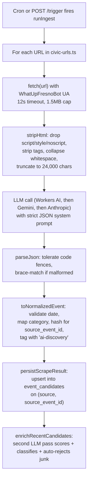

# AI Discovery: how URL-based event extraction works

This is a working reference for how the `ai-discovery` source turns a list of URLs into reviewable event candidates. Use it when adding new URLs, debugging missing events, or deciding whether a site is a good fit for this pipeline.

## The current pipeline

For every URL in [`workers/ingest/src/sources/civic-urls.ts`](../workers/ingest/src/sources/civic-urls.ts) (wired into the `ai-discovery` source in `registry.ts`), one run does the following.



### Step by step, with file references

1. **Fetch HTML** — [workers/ingest/src/scrapers/ai-discovery.ts](../workers/ingest/src/scrapers/ai-discovery.ts), `fetchHtml`. Plain `fetch()`. User-Agent is `WhatUpFresnoBot/0.1 (contact: admin@whatupfresno.com)`. 12-second timeout, 1.5 MB body cap. No headless browser, no JS execution.

2. **Strip to plain text** — [workers/ingest/src/ai.ts](../workers/ingest/src/ai.ts), `stripHtml`. Regex pass that drops `<script>` / `<style>` / `<noscript>` blocks, then every remaining tag, decodes `&nbsp;`, collapses whitespace. The result is then sliced to **24,000 characters** before being sent to the LLM.

3. **LLM extraction call** — [workers/ingest/src/ai.ts](../workers/ingest/src/ai.ts), `discoverEventsFromHtml`. System prompt asks for strict JSON: `{ events: [{ title, startTs, venueName, ... }] }`. Only events within 50 miles of Fresno in the next 90 days. Backend resolves via [workers/ingest/src/llm/registry.ts](../workers/ingest/src/llm/registry.ts) (`AI_TEXT_PROVIDER_DISCOVERY` or global `AI_TEXT_PROVIDER`), in this order:
   - **Workers AI** (`@cf/meta/llama-3.1-8b-instruct`) if the `[ai]` binding is present and selected.
   - **Gemini** (`GEMINI_API_KEY` or `GOOGLE_API_KEY`, default model `gemini-2.5-flash`).
   - **Anthropic** (`ANTHROPIC_API_KEY`, Claude 3.5 Haiku).
   - None available → source records `last_status='error'` and writes zero candidates.

4. **Parse JSON defensively** — [workers/ingest/src/ai.ts](../workers/ingest/src/ai.ts), `parseJson`. Strips ```json``` fences, falls back to a regex brace-match if the LLM added prose. Items that fail the `isPlausibleEvent` shape check (missing title/venue/startTs) are dropped silently.

5. **Normalize** — [workers/ingest/src/scrapers/ai-discovery.ts](../workers/ingest/src/scrapers/ai-discovery.ts), `toNormalizedEvent`. Validates the date is parseable, coerces unknown categories to `community`, generates a stable `source_event_id` as `ai:<hash of title|venue|startTs|sourceUrl>` for dedup, defaults `venueCity='Fresno'`, `currency='USD'`, `timezone='America/Los_Angeles'`. Capped at `maxPerUrl` (default 20) per URL.

6. **Persist** — [workers/ingest/src/candidates.ts](../workers/ingest/src/candidates.ts), `persistScrapeResult`. Upserts into `event_candidates` with `ON CONFLICT (source, source_event_id) DO MERGE`. Initial `confidence_score = 0.7` for AI-discovered candidates (Ticketmaster gets 0.84). Re-runs refresh existing pending-review rows; approved rows in `events` are updated by the refresh pass on **dev** ingest (future work; see [INGESTION_OVERHAUL_PLAN.md](INGESTION_OVERHAUL_PLAN.md)).

7. **AI enrichment** — [workers/ingest/src/enrichment.ts](../workers/ingest/src/enrichment.ts) calls `enrichCandidate` from `ai.ts`. Second, smaller LLM call that:
   - Rates `confidence` (0..1), overwriting the 0.7 default.
   - Suggests a better `category` and `cleaned_title`.
   - Merges `tags`.
   - Auto-rejects junk (`is_junk: true` → `status='rejected'`, `reviewed_by='ai'`) so it never reaches your admin queue.
   - Writes `[ai] <reasoning>` to `review_notes`.

   Budget: `MAX_ENRICH_PER_RUN` (default 25 per run).

So a candidate reaches your admin UI only if the extractor pulled it, the enricher didn't flag it as junk, and it's still `pending_review`.

## Testing extraction quality

Dry-run is available via `pnpm ingest:run --dry-run` (see [LAUNCH_PLAN.md](LAUNCH_PLAN.md)). Until `ai-crawl` ships, use a normal run or edit URLs in Studio:

```bash
# tab 1
pnpm ingest:dev

# tab 2 - prints normalized JSON without persisting
pnpm ingest:run --source=ai-discovery --dry-run
```

To test a single URL, temporarily edit `civic-urls.ts` (or pass a short list in `registry.ts` while developing), then `pnpm ingest:run --source=ai-discovery --dry-run`. A `--url=` CLI override is reasonable future work.

To see what an actual run produced (real persistence, no dry-run):
- Live structured logs: `wrangler tail fresno-events-ingest` (deployed) or watch the `pnpm ingest:dev` terminal.
- Per-source runs: `select * from public.ingest_runs where source='ai-discovery' order by started_at desc limit 5;`
- Per-run metrics: `select * from public.ingest_runs where source='ai-discovery' order by started_at desc limit 5;`
- The candidates themselves: filter `event_candidates` by `source_url like '<url>%'` or join through `run_id`.

## What works well

- **Server-rendered event listing pages.** Most municipal calendar pages, traditional theater/venue sites (Tower, Strummers, Save Mart Center), and news event sections.
- **Pages where the event listing is in the visible HTML on first load** — no JS frameworks needed.
- **Short to medium pages.** A single month of events on a calendar usually fits in 24K chars.
- **Pages that include date + venue + title in the listing text** — the LLM doesn't need to follow links to extract the basics.

## Known limitations

These will produce missing, partial, or wrong data with the current pipeline. Worth knowing before adding a URL to the seed list, and worth weighing when picking a "better tool" later.

### 1. No JavaScript execution

`fetch()` returns the raw initial HTML. Pages whose calendars are rendered client-side (React/Vue/Svelte event widgets, lazy-loaded "next month" buttons, Eventbrite embedded iframes, Squarespace event blocks that hydrate after load) effectively return empty text after `stripHtml`. **Fix path:** Cloudflare Browser Rendering binding (headless Chromium in Workers) or an external tool like Firecrawl, Browserless, or ScrapingBee. All out of scope for v1.

### 2. 24,000 character truncation

`stripHtml` slices to 24K chars before the LLM call ([workers/ingest/src/ai.ts](../workers/ingest/src/ai.ts) `discoverEventsFromHtml`). Long monthly calendars or "all events" pages with hundreds of items get the tail chopped off, so we extract the first chunk and miss the rest. **Fix path:** chunk the HTML and run multiple LLM calls per page; or scope each URL to a single month and rely on cadence to catch newer events.

### 3. Calendar pagination is not followed

If a venue's calendar paginates with `?month=2026-05`, `?page=2`, or a "Load more" button, only the default landing view is fetched. Future months and overflow lists are invisible to us. **Fix path:** per-URL config that templates a pagination URL pattern (`{baseUrl}?month={YYYY-MM}` over a 3-month window), or a smarter agent that follows pagination links from the first page.

### 4. Per-event detail pages are not followed

If a venue's calendar lists 30 events as title + link, but the actual time, image, description, and ticket URL live one click deeper on `/events/:slug`, we only see what's in the listing. The LLM is told not to invent details, so it'll skip fields it can't see. **Fix path:** two-pass mode where we first extract candidate URLs from the listing, then fetch each detail page and extract again. More cost, but materially better data quality.

### 5. JS-heavy SPAs hide everything

Sites like Eventbrite event pages, Facebook events, and many city dashboards render with JS-only frameworks. They look fine in a browser but return a near-empty HTML shell to `fetch()`. The pipeline silently extracts zero events from them.

### 6. Date parsing relies entirely on the LLM

"Friday at 8pm" without a year context can produce ISO strings in 2027 or 2032. `toNormalizedEvent` only rejects unparseable dates, not implausible ones. The enrichment pass catches some obvious junk but isn't a date-sanity check. **Fix path:** add an "events more than 18 months out get auto-flagged" rule in normalization or enrichment.

### 7. The `source` column is lossy

In the current code, every AI-discovered event sets `normalizedEvent.source = "manual"` for the persist step, regardless of which URL it came from. That means we can't easily filter "all events that came from Tower Theatre's calendar" in SQL — we have to look at `source_url` instead. Not catastrophic; flagged as a future cleanup (change to `scrape:<host>` or similar).

### 8. Images are not auto-discovered

If the LLM doesn't extract a usable `imageUrl` from the listing text, the candidate has no hero image until you add one in the admin UI before approval. Mirroring to R2 happens at approve time, not extract time.

### 9. Cost characteristics

Each URL = one LLM extraction call per run, plus one enrichment call per surfaced candidate. With Workers AI (Llama 3.1 8B) the cost is effectively zero on the free tier. With Anthropic Haiku it's roughly $0.001-0.003 per page. 30 URLs in the seed list, twice daily = 60 extraction calls/day, which is pennies even with Haiku. So cost isn't the bottleneck; coverage and JS-rendering are.

### 10. No verification that an extracted event is "real"

The enrichment pass classifies obvious junk (ads, gift cards, parking passes, NSFW, far-away events) but won't catch hallucinations. If the LLM confabulates a plausible-sounding event from ambiguous text, it ships to the admin queue. The `confidence_score` is your tripwire — anything below ~0.6 is worth a careful look before approving.

## When to use this pipeline vs something else

- **Good fit:** server-rendered event listings, municipal/civic calendars, traditional venue pages, college event pages, museum calendars, blog/news event roundups. Most of the seeded URLs in the upcoming civic-seeds migration are in this bucket.
- **Poor fit (skip or wait for browser rendering):** Eventbrite event detail pages, Facebook event pages, JS-only SPA dashboards, anything behind login or aggressive bot protection.
- **Better as a dedicated scraper:** anything with a public REST API (Ticketmaster, SeatGeek, Bandsintown, Eventbrite organizer API, Meetup). The HTML pipeline is for sources that don't have one.

## Future improvements being weighed

In rough order of likely impact:

1. **Cloudflare Browser Rendering** for JS-rendered sites — unblocks Eventbrite-class sources and modern SPA calendars.
2. **External crawl service** (Firecrawl, ScrapingBee, Browserless) — same goal as Browser Rendering, different cost/flexibility tradeoff; might also handle pagination/sub-pages.
3. **Two-pass extraction**: listing page → candidate URLs → per-detail-page extraction. Big quality win on venue sites.
4. **Per-URL pagination config** in `event_sources.config.urls[].paginate`.
5. **Search-grounded discovery agent**: weekly job that queries Brave/Google CSE for "fresno events" and feeds discovered URLs back into the seed list.
6. **Single-URL dry-run flag** (`pnpm ingest:run --source=ai-discovery --url=https://...`) for fast iteration on one page.
7. **Source column fix** (`scrape:<host>` instead of `manual`).
8. **Date sanity check** in normalization.

None of these are committed yet. They're the obvious next moves once the daily review/refresh loop is humming.
