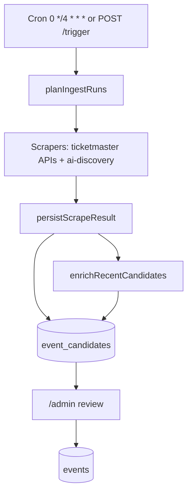
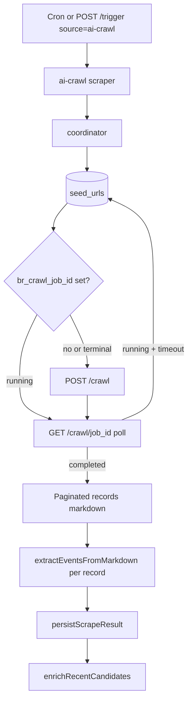

# What Up Fresno — Ingestion Overhaul + Event Priority

**Open this file for team review:** [`docs/INGESTION_OVERHAUL_PLAN.md`](INGESTION_OVERHAUL_PLAN.md) (architecture + code reference).

**What to do by hand first:** [LAUNCH_PLAN.md](LAUNCH_PLAN.md) (Phase 1 setup → Phase 3 ingest → Phase 4 UI). This file is the **implementation spec** for the agent. Section 11 records team-plan review notes.

**Status:** Approved for manual setup (Phase 1 in [LAUNCH_PLAN.md](LAUNCH_PLAN.md)); code not implemented yet.  
**Last updated:** May 2026 (tiny fixes: dry-run read-only, `--resume-jobs`, in-tree READMEs §12)

---

## 1. Executive summary

What Up Fresno already ingests events via a **Cloudflare ingest Worker** into **`event_candidates`**, then humans approve into **`events`**. That pipeline stays.

This plan adds two capabilities:

| Part | What | Why |
|------|------|-----|
| **Part 1** | `priority` column (0–5) on published `events` | Editorial/sponsored ordering in the app (today: first list index = “featured”) |
| **Part 2** | Replace `ai-discovery` with **`ai-crawl`** using [Browser Rendering `/crawl`](https://developers.cloudflare.com/browser-run/quick-actions/crawl-endpoint/) + **Workers LLM** | Plain `fetch()` misses JS calendars, pagination, and detail pages |

**Decided:** Cloudflare only for fetch/render. No Firecrawl, no Crawl4AI.  
**Decided:** Resume the **same Browser Rendering job id** if a Worker invocation times out while polling.  
**Decided:** Soft cutover — keep `ai-discovery` in repo until `ai-crawl` is validated.

---

## 2. Current architecture (baseline)



| Component | Path | Role |
|-----------|------|------|
| Ingest Worker entry | [`workers/ingest/src/index.ts`](workers/ingest/src/index.ts) | `scheduled()` → `runIngest()`; `POST /trigger?source=&force=&dry_run=` |
| Orchestration | [`workers/ingest/src/runner.ts`](workers/ingest/src/runner.ts) | Plan sources → run scrapers → persist → enrich (unless `dryRun`) |
| Source registry | [`workers/ingest/src/registry.ts`](workers/ingest/src/registry.ts) | `ticketmaster`, APIs, `ai-discovery` (8 hardcoded URLs) |
| AI HTML extract | [`workers/ingest/src/ai.ts`](workers/ingest/src/ai.ts) | `discoverEventsFromHtml` — strip HTML, 24k cap, LLM JSON |
| Persistence | [`workers/ingest/src/candidates.ts`](workers/ingest/src/candidates.ts) | Upsert `event_candidates` on `(source, source_event_id)` |
| Shared types | [`packages/shared/src/index.ts`](packages/shared/src/index.ts) | `Event`, `NormalizedEvent`, `EventCandidate` |
| Public list API | [`apps/api/src/lib/supabase-events.ts`](apps/api/src/lib/supabase-events.ts) | `order: start_ts.asc` today |
| Approve API | [`apps/api/src/routes/review.ts`](apps/api/src/routes/review.ts) | `POST /review/candidates/:id/approve` |
| Today UI | [`apps/web/src/features/events/api.ts`](apps/web/src/features/events/api.ts) | `featured: index === 0` hack |

**Known bug to fix in Part 2:** [`ai-discovery.ts` line 159](workers/ingest/src/scrapers/ai-discovery.ts) sets `source: "manual"` instead of `scrape:<hostname>`.

**Prod:** Ingest cron is off for prod scraping ([`workers/ingest/wrangler.toml`](workers/ingest/wrangler.toml)); dev ingest → approve → promote later.

---

## 3. Goals and non-goals

### Goals

1. **Priority field** — 0 = promoted/sponsored, 1 = headline, 5 = default; sort ascending in API.
2. **JS-capable crawling** — Browser Rendering renders pages, follows links within budget.
3. **Minimal per-site engineering** — new venue = `INSERT` into `seed_urls`, not a code change.
4. **Resume BR jobs** — persist `br_crawl_job_id`; next run polls same job until terminal.
5. **Slim crawls** — `rejectResourceTypes: ["image","media","font","stylesheet"]` initially.

### Non-goals

- Postgres → other DB; AWS migration; frontend framework change
- Firecrawl / Crawl4AI / other crawl vendors
- Priority on `event_candidates` or scraper-assigned priority
- Auto hero images in v1 (re-enable `image` in `rejectResourceTypes` later)
- Puppeteer single-page fallback in v1 (optional Phase C+)

---

## 4. Part 1 — Event priority (ship first)

### 4.1 Semantics

**Lower number = more prominent** (sort `priority ASC`, then `start_ts ASC`).

| Value | Meaning | Expected volume |
|-------|---------|-----------------|
| 0 | Promoted / sponsored | Few |
| 1 | Major headline / “start here” | Few |
| 2–4 | Editorial tiers (labels TBD in admin copy) | Rare |
| 5 | Default ordinary events | Majority |

- Set at **approve time** in admin — not during ingest.
- **Not** on `NormalizedEvent` — scrapers and candidates unchanged.

### 4.2 Database migration

**File:** `supabase/migrations/20260522000000_add_event_priority.sql` (next free timestamp after `20260521000000_drop_event_sources.sql`; bump if another migration lands first)

```sql
alter table public.events
  add column priority smallint not null default 5
  check (priority between 0 and 5);

create index events_priority_start_ts_idx
  on public.events (priority asc, start_ts asc)
  where status in ('scheduled', 'sold_out', 'postponed');

comment on column public.events.priority is
  'Editorial display priority. 0=promoted, 1=headline, 2-4=tiers, 5=default. Sort ascending.';
```

Existing rows get `5` via default. Optional in [`supabase/seed.sql`](supabase/seed.sql): set 1–2 demo events to `0` and `1`.

### 4.3 Shared types

**File:** [`packages/shared/src/index.ts`](packages/shared/src/index.ts)

```ts
export const EVENT_PRIORITY_MIN = 0;
export const EVENT_PRIORITY_MAX = 5;
export const EVENT_PRIORITY_DEFAULT = 5;

export interface Event {
  // ...existing fields...
  priority: number;
}
```

Do **not** add `priority` to `NormalizedEvent`.

### 4.4 API — public list

**File:** [`apps/api/src/routes/events.utils.ts`](apps/api/src/routes/events.utils.ts)

```ts
export function parseMaxPriority(value: string | undefined): number | undefined {
  if (!value) return undefined;
  const parsed = Number(value);
  if (!Number.isInteger(parsed) || parsed < EVENT_PRIORITY_MIN || parsed > EVENT_PRIORITY_MAX) {
    return null; // caller returns 400
  }
  return parsed;
}
```

**File:** [`apps/api/src/lib/supabase-events.ts`](apps/api/src/lib/supabase-events.ts)

- Add `priority` to `eventSelect` column list (~line 95).
- Change list query:

```ts
order: "priority.asc,start_ts.asc",
```

- When `maxPriority` provided:

```ts
params.set("priority", `lte.${options.maxPriority}`);
```

- In `mapEventRow`, always map `priority: row.priority ?? EVENT_PRIORITY_DEFAULT`.

**File:** [`apps/api/src/routes/events.ts`](apps/api/src/routes/events.ts)

```ts
const maxPriority = parseMaxPriority(c.req.query("maxPriority"));
if (maxPriority === null) {
  return fail(c, "invalid_max_priority", "maxPriority must be an integer 0–5.", 400);
}
await listEventsFromSupabase(c.env, { from, limit, ...(until ? { until } : {}), ...(maxPriority !== undefined ? { maxPriority } : {}) });
```

### 4.5 API — approve

**File:** [`apps/api/src/routes/review.ts`](apps/api/src/routes/review.ts)

Approve handler today calls `mergeNormalizedEvent(candidate.normalizedEvent, body.event)` then `upsertEvent(...)`.

**Change:** read priority from top-level body, not `body.event`:

```ts
function parseApprovePriority(body: Record<string, unknown>): number {
  const raw = body.priority;
  if (raw === undefined) return EVENT_PRIORITY_DEFAULT;
  if (typeof raw !== "number" || !Number.isInteger(raw) || raw < 0 || raw > 5) {
    throw new ReviewRouteError("priority must be an integer 0–5.", 400);
  }
  return raw;
}

// In POST /candidates/:id/approve:
const priority = parseApprovePriority(body);
const event = await upsertEvent(c.env, candidate, normalized, venue.id, heroImage?.id ?? null, priority);
```

`upsertEvent` body addition:

```ts
priority,
```

Update **both** `mapEventRow` implementations in `supabase-events.ts` and `review.ts`.

### 4.6 Admin UI

**File:** [`apps/web/src/features/admin/admin-api.ts`](apps/web/src/features/admin/admin-api.ts)

```ts
export interface ApproveBody {
  event?: Partial<NormalizedEvent>;
  notes?: string;
  reviewedBy?: string;
  priority?: number;
}
```

**File:** [`apps/web/src/features/admin/admin-page.tsx`](apps/web/src/features/admin/admin-page.tsx)

- State: `const [priority, setPriority] = useState(5)`.
- Reset to `5` when `candidate.id` changes.
- `<select>` options 0–5 with labels (product copy):

  - 0 — Promoted (sponsored)
  - 1 — Headline
  - 2–4 — Tier 2 / 3 / 4 (or “Editorial” until copy finalized)
  - 5 — Default

- `approveCandidate(..., { ..., priority })`.

**Defer v1:** list badge for promoted events (requires join `events` on `matched_event_id`).

### 4.7 Public web

**File:** [`apps/web/src/features/events/api.ts`](apps/web/src/features/events/api.ts)

Remove:

```ts
...(index === 0 ? { featured: true as const } : {})
```

Replace with:

```ts
...(item.event.priority <= 1 ? { featured: true as const } : {})
```

Optional: `listTodayEvents` calls API with `maxPriority=1` for top carousel only (full list elsewhere).

**File:** [`apps/web/src/features/events/today-page.tsx`](apps/web/src/features/events/today-page.tsx)

```tsx
// Replace priority={index === 0} with:
const p = event.event.priority;
<TopEventCard event={event} displayPriority={p} />

function TopEventCard({ event, displayPriority }: { event: TodayEventItem; displayPriority: number }) {
  const kicker =
    displayPriority === 0 ? "Sponsored" :
    displayPriority === 1 ? "Start here" :
    event.kicker;
  // displayPriority === 0 → distinct border/label styling (e.g. accent ring)
}
```

**File:** [`apps/web/src/features/events/types.ts`](apps/web/src/features/events/types.ts) — optional `isPromoted?: boolean` derived from `priority === 0`.

### 4.8 Ingest / docs

- No Worker changes.
- [`docs/INGEST.md`](docs/INGEST.md): one line — priority is editorial at approve, default 5.

### 4.9 Part 1 validation

1. Approve one event with `priority: 0`, one with `1`, several with default.
2. `GET /events` returns 0 first, then 1, then 5s by `start_ts`.
3. Today page shows “Sponsored” vs “Start here” correctly; no `index === 0` dependency.

---

## 5. Part 2 — AI crawl (Cloudflare Browser Rendering + Workers)

### 5.1 Target architecture



**LLM:** existing [`workers/ingest/src/llm/registry.ts`](workers/ingest/src/llm/registry.ts) with role `discovery` (Workers AI → Gemini → Anthropic).  
**Enrichment:** unchanged [`workers/ingest/src/enrichment.ts`](workers/ingest/src/enrichment.ts).

### 5.2 Browser Rendering `/crawl` API

**Docs:** [Crawl endpoint](https://developers.cloudflare.com/browser-run/quick-actions/crawl-endpoint/) · [Changelog Mar 10, 2026](https://developers.cloudflare.com/changelog/post/2026-03-10-br-crawl-endpoint/)

| Step | HTTP | Notes |
|------|------|-------|
| Start | `POST https://api.cloudflare.com/client/v4/accounts/{account_id}/browser-rendering/crawl` | Returns job id string |
| Poll | `GET .../browser-rendering/crawl/{job_id}?limit=1` | Lightweight status check |
| Results | `GET .../browser-rendering/crawl/{job_id}` | Paginate with `cursor` if >10MB |

**Auth:** `Authorization: Bearer {CLOUDFLARE_API_TOKEN}` with **Browser Rendering - Edit**.

**Job statuses:** `running` | `completed` | `errored` | `cancelled_*`  
**Result retention:** 14 days after completion (supports resume).

### 5.3 Default crawl payload (per seed)

**File:** `workers/ingest/src/browser-rendering/crawl-defaults.ts`

```ts
export const DEFAULT_REJECT_RESOURCE_TYPES = [
  "image",
  "media",
  "font",
  "stylesheet",
] as const;

export const CRAWL_LIMITS = {
  MAX_PAGES_PER_SEED: 30,
  MAX_DEPTH: 3,
  MAX_LLM_CALLS_PER_RUN: 200,
  PER_SEED_POLL_TIMEOUT_MS: 8 * 60 * 1000, // 8 min per seed in one invocation
  POLL_INTERVAL_MS: 5_000,
  PER_SEED_DELAY_MS: 1_000,
  /** Char cap fed to the LLM per record. Markdown is denser than HTML; 60k ≈ a long page. */
  MARKDOWN_CHAR_LIMIT: 60_000,
} as const;

export function buildCrawlRequest(seed: SeedUrlRow, env: IngestEnv): BrCrawlRequestBody {
  const limit = parsePositiveInt(env.MAX_PAGES_PER_SEED, CRAWL_LIMITS.MAX_PAGES_PER_SEED);
  const depth = parsePositiveInt(env.MAX_CRAWL_DEPTH, CRAWL_LIMITS.MAX_DEPTH);
  return {
    url: seed.url,
    limit,
    depth,
    render: true,
    formats: ["markdown"],
    rejectResourceTypes: [...DEFAULT_REJECT_RESOURCE_TYPES],
    crawlPurposes: ["search", "ai-input"],
    options: {
      includeExternalLinks: false,
      includeSubdomains: false, // start strict; flip to true per-seed via seed_urls.notes if a venue legitimately spans subdomains
    },
    ...(seed.last_successful_crawl_at
      ? { modifiedSince: Math.floor(new Date(seed.last_successful_crawl_at).getTime() / 1000) }
      : {}),
  };
}
```

### 5.4 BR job resume (decided)

**State on `seed_urls`:**

| Column | Type | Purpose |
|--------|------|---------|
| `br_crawl_job_id` | `text` nullable | Active Cloudflare job id |
| `br_crawl_status` | `text` nullable | Mirror of last known BR status: `running`, `completed`, … |
| `br_crawl_started_at` | `timestamptz` | When job was started |
| `last_successful_crawl_at` | `timestamptz` | For `modifiedSince` on next run |
| `events_found_last_run` | `integer` | Metrics for admin |

**Run modes** (decided — see §5.4a for rationale):

| Mode | Trigger | Starts new BR jobs? | Polls in-flight jobs? | Writes `event_candidates`? | Writes `seed_urls`? |
|------|---------|---------------------|-----------------------|----------------------------|---------------------|
| **Real** | `--force` (no other flags) | Yes | Yes | Yes | Yes |
| **Dry-run** | `--dry-run --force` | Yes (cost is real) | Yes | **No** | **No** (fully read-only against DB) |
| **Resume-jobs** | `--resume-jobs --force` | **No** | Yes (only seeds with non-null, non-terminal `br_crawl_job_id`) | Yes | Yes |
| **Cron (default)** | scheduler with no flag | Yes | Yes | Yes | Yes |

**`CoordinatorContext` carries the mode:**

```ts
export type CoordinatorMode = "real" | "dry-run" | "resume-jobs";

export interface CoordinatorContext {
  mode: CoordinatorMode;
  llmCalls: number;
  errors: ScrapeError[];
}
```

**Coordinator logic per seed:**

```ts
async function processSeed(env: IngestEnv, seed: SeedUrlRow, ctx: CoordinatorContext): Promise<NormalizedEvent[]> {
  const persistSeedState = ctx.mode !== "dry-run"; // dry-run is read-only against the DB
  const mayStartNewJob = ctx.mode !== "resume-jobs";
  let jobId = seed.br_crawl_job_id;

  if (!jobId || isTerminal(seed.br_crawl_status)) {
    if (!mayStartNewJob) return []; // resume-jobs skips seeds without an in-flight job
    jobId = await brClient.startCrawl(buildCrawlRequest(seed, env));
    if (persistSeedState) {
      await updateSeed(env, seed.id, {
        br_crawl_job_id: jobId,
        br_crawl_status: "running",
        br_crawl_started_at: new Date().toISOString(),
      });
    }
  }

  const deadline = Date.now() + CRAWL_LIMITS.PER_SEED_POLL_TIMEOUT_MS;
  let status = "running";

  while (status === "running" && Date.now() < deadline) {
    const job = await brClient.getCrawlJob(jobId, { limit: 1 });
    status = job.status;
    if (persistSeedState) await updateSeed(env, seed.id, { br_crawl_status: status });
    if (status === "running") await sleep(CRAWL_LIMITS.POLL_INTERVAL_MS);
  }

  if (status !== "completed") {
    // Leave br_crawl_job_id in place (real/resume-jobs modes) — next cron or
    // `--resume-jobs` run picks up the same job. Dry-run never wrote it.
    ctx.errors.push({ source: "ai-crawl", url: seed.url, message: `BR job ${jobId} still ${status}`, recoverable: true });
    return [];
  }

  const records = await brClient.fetchAllRecords(jobId);
  const events: NormalizedEvent[] = [];

  for (const record of records) {
    if (record.status !== "completed" || !record.markdown?.trim()) continue;
    if (ctx.llmCalls >= CRAWL_LIMITS.MAX_LLM_CALLS_PER_RUN) break;

    const extracted = await extractEventsFromMarkdown(env, {
      url: record.url,
      label: seed.label ?? seed.url,
      markdown: record.markdown.slice(0, CRAWL_LIMITS.MARKDOWN_CHAR_LIMIT),
    });
    ctx.llmCalls += 1;

    for (const item of extracted) {
      const normalized = toNormalizedEvent(item, record.url, seed.url);
      if (normalized) events.push(normalized);
    }
  }

  if (persistSeedState) {
    await updateSeed(env, seed.id, {
      br_crawl_job_id: null,
      br_crawl_status: "completed",
      last_successful_crawl_at: new Date().toISOString(),
      events_found_last_run: events.length,
    });
  }

  return events;
}
```

> **`events_found_last_run` during dry-run:** not written to `seed_urls`, but **always** included in the dry-run response JSON per seed so operators get the same signal without DB mutation.

### 5.4a Why this dry-run policy

`--dry-run` should mean what most readers expect: simulate the run, change nothing in the database. Threading `mode` through the coordinator costs ~6 lines but gives us:

- **Predictable, repeatable dry-runs.** Iterate on extractor prompts without `seed_urls` drifting underneath you.
- **No surprise side-effects.** Operators can dry-run safely against the **cloud-dev** Supabase to preview what real ingest would produce.
- **A clean separate channel for resume testing.** `--resume-jobs` is the right tool for validation gate 5 (kill mid-poll → resume). It's a real run that happens to skip starting new jobs, so it exercises only the polling/extracting/persisting code paths against state from a previous real or cron run.

The cost of fresh BR jobs each dry-run is bounded by `MAX_PAGES_PER_SEED` (env var, default 30, easy to drop to `3` for prompt iteration).

### 5.5 Database — seed_urls

**File:** `supabase/migrations/20260522000100_add_seed_urls.sql` (immediately after the priority migration)

```sql
create table public.seed_urls (
  id uuid primary key default gen_random_uuid(),
  url text not null unique,
  label text,
  enabled boolean not null default true,
  notes text,
  br_crawl_job_id text,
  br_crawl_status text,
  br_crawl_started_at timestamptz,
  last_successful_crawl_at timestamptz,
  events_found_last_run integer,
  created_at timestamptz not null default now(),
  updated_at timestamptz not null default now()
);

create index seed_urls_enabled_idx on public.seed_urls (enabled) where enabled = true;

-- RLS: no public access; ingest uses service role
alter table public.seed_urls enable row level security;

-- Seed from civic-urls.ts (8 rows)
insert into public.seed_urls (url, label) values
  ('https://towertheatrefresno.com/events', 'Tower Theatre'),
  ('https://www.fultonstreetfresno.com/events', 'Fulton Street Events'),
  ('https://www.savemart.center/events', 'Save Mart Center'),
  ('https://www.fresnofairgrounds.com/calendar', 'Big Fresno Fair'),
  ('https://www.cityoffresno.gov/parks/events/', 'City of Fresno Parks'),
  ('https://strummers.com/', 'Strummers'),
  ('https://www.valhallabar.com/events', 'Valhalla'),
  ('https://www.tiogasequoia.com/taproom-events', 'Tioga-Sequoia');
```

### 5.6 Browser Rendering client

**File:** `workers/ingest/src/browser-rendering/crawl-client.ts`

```ts
const BASE = (accountId: string) =>
  `https://api.cloudflare.com/client/v4/accounts/${accountId}/browser-rendering/crawl`;

export async function startCrawl(env: IngestEnv, body: BrCrawlRequestBody): Promise<string> {
  const res = await fetch(BASE(env.CLOUDFLARE_ACCOUNT_ID!), {
    method: "POST",
    headers: brHeaders(env),
    body: JSON.stringify(body),
  });
  const json = await parseBrResponse<{ result: string }>(res);
  return json.result; // job id
}

export async function getCrawlJob(env: IngestEnv, jobId: string, opts?: { limit?: number }): Promise<BrCrawlJob> {
  const q = opts?.limit ? `?limit=${opts.limit}` : "";
  const res = await fetch(`${BASE(env.CLOUDFLARE_ACCOUNT_ID!)}/${jobId}${q}`, { headers: brHeaders(env) });
  const json = await parseBrResponse<{ result: BrCrawlJob }>(res);
  return json.result;
}

export async function fetchAllRecords(env: IngestEnv, jobId: string): Promise<BrCrawlRecord[]> {
  const out: BrCrawlRecord[] = [];
  let cursor: string | undefined;
  do {
    const q = new URLSearchParams({ status: "completed" });
    if (cursor) q.set("cursor", cursor);
    const res = await fetch(`${BASE(env.CLOUDFLARE_ACCOUNT_ID!)}/${jobId}?${q}`, { headers: brHeaders(env) });
    const json = await parseBrResponse<{ result: BrCrawlJob; result_info?: { cursor?: string } }>(res);
    out.push(...(json.result.records ?? []));
    // CF API envelopes typically expose pagination on `result_info.cursor`. Some BR responses
    // surface it on `result.cursor` instead — verify against the §1.5 / §4b spike before locking
    // this in. Read both and prefer whichever the spike returns.
    cursor = json.result_info?.cursor ?? json.result.cursor;
  } while (cursor);
  return out;
}
```

> **Confirm with the BR curl spike (§1.5 / §4b):** record both the cursor field name and the
> `record.status` enum (`completed` | `errored` | `disallowed` | `skipped` | …) before writing
> `crawl-client.ts` and `types.ts`.

**File:** `workers/ingest/src/browser-rendering/types.ts` — `BrCrawlRecord`, `BrCrawlJob`, request body types matching [API reference](https://developers.cloudflare.com/api/resources/browser_rendering/subresources/crawl/methods/create/).

### 5.7 Markdown extractor

**File:** `workers/ingest/src/ai/extractor.ts`

Port prompts from [`discoverEventsFromHtml`](workers/ingest/src/ai.ts) — swap “Page text” for “Page markdown”:

```ts
export async function extractEventsFromMarkdown(
  env: IngestEnv,
  args: { url: string; label: string; markdown: string },
): Promise<AiDiscoveryItem[]> {
  const backend = getJsonPromptBackend(env, "discovery");
  if (!backend || args.markdown.length < 200) return [];

  const system = [
    "You extract upcoming public events from a single web page (markdown).",
    "Only return events within 50 miles of Fresno, California in the next 90 days.",
    "Return minified JSON with key `events`: array of { title, startTs, venueName, ... }.",
    "If a date is missing, omit the event. Never invent details.",
  ].join(" ");

  const user = [
    `Source label: ${args.label}`,
    `Source URL: ${args.url}`,
    `Search area: lat=${fresnoSearchArea.lat}, lng=${fresnoSearchArea.lng}, radius=${fresnoSearchArea.radiusMiles}mi`,
    "--- BEGIN MARKDOWN ---",
    args.markdown,
    "--- END MARKDOWN ---",
  ].join("\n");

  const result = await backend.generateJson<{ events?: AiDiscoveryItem[] }>({ system, user });
  return Array.isArray(result?.events) ? result.events.filter(isPlausibleEvent) : [];
}
```

Reuse `isPlausibleEvent` from `ai.ts` (export or move to `ai/shared.ts`).

### 5.8 Normalized event + source

**File:** `workers/ingest/src/scrapers/ai-crawl.ts` (or `coordinator.ts`)

```ts
function toNormalizedEvent(item: AiDiscoveryItem, pageUrl: string, seedUrl: string): NormalizedEvent | null {
  // same date validation as ai-discovery
  const host = new URL(seedUrl).hostname.replace(/^www\./, "");
  return {
    source: `scrape:${host}`,  // NOT "manual"
    sourceEventId: `ai:${hashSync(`${item.title}|${item.venueName}|${startIso}|${pageUrl}`)}`,
    title: item.title.trim(),
    venueName: item.venueName.trim(),
    startTs: startIso,
    timezone: "America/Los_Angeles",
    category: coercedCategory,
    tags: ["ai-crawl"],
    currency: "USD",
    externalUrl: item.externalUrl ?? pageUrl,
    venueCity: item.venueCity ?? "Fresno",
    // optional fields...
  };
}
```

### 5.9 ai-crawl scraper + registry

**File:** `workers/ingest/src/scrapers/ai-crawl.ts`

```ts
export function createAiCrawlRunner(env: IngestEnv): ScraperRun {
  return async (ctx: ScrapeContext): Promise<ScrapeResult> => {
    const started = performance.now();
    if (!env.CLOUDFLARE_ACCOUNT_ID || !env.CLOUDFLARE_API_TOKEN) {
      return result(ctx, [], [{ source: "ai-crawl", message: "BR credentials missing", recoverable: true }], 0, started);
    }
    const seeds = await loadEnabledSeedUrls(env);
    const { events, errors, metrics } = await runCoordinator(env, seeds, ctx);
    return {
      source: "ai-crawl",
      runId: ctx.runId,
      events,
      errors,
      metrics: { pagesVisited: metrics.pagesVisited, durationMs: Math.round(performance.now() - started) },
    };
  };
}
```

**File:** [`workers/ingest/src/registry.ts`](workers/ingest/src/registry.ts)

```ts
{
  key: "ai-crawl",
  label: "AI crawl (Browser Rendering)",
  defaultCadenceMinutes: 1440,
  enabledByDefault: false, // enable manually during validation
  requiredSecrets: ["CLOUDFLARE_ACCOUNT_ID", "CLOUDFLARE_API_TOKEN"],
  runFactory: (env) => createAiCrawlRunner(env),
},
// keep ai-discovery entry during soft cutover
```

**Runner:** add `resumeJobs?: boolean` to `RunOptions`, plumb into the `ScrapeContext` so `createAiCrawlRunner` can build the right `CoordinatorContext.mode`. `persistScrapeResult` continues to be skipped when `dryRun` is true (existing behavior).

**Trigger endpoint:** [`workers/ingest/src/index.ts`](workers/ingest/src/index.ts) — `POST /trigger` accepts a new query param:

```
POST /trigger?source=ai-crawl&force=true&resume_jobs=true
```

`resume_jobs=true` is mutually exclusive with `dry_run=true` (return `400` if both are set). Other scrapers (Ticketmaster, etc.) ignore the flag — only `ai-crawl` reads `mode` from `ScrapeContext`.

**Script:** [`scripts/ingest-run.sh`](../scripts/ingest-run.sh) gains a `--resume-jobs` flag that adds `&resume_jobs=true` to the query string.

### 5.10 Environment and Wrangler

**File:** [`workers/ingest/src/env.ts`](workers/ingest/src/env.ts)

```ts
export interface IngestEnv {
  // ...existing...
  CLOUDFLARE_ACCOUNT_ID?: string;
  CLOUDFLARE_API_TOKEN?: string;
  MAX_PAGES_PER_SEED?: string;
  MAX_CRAWL_DEPTH?: string;
  AI?: Ai;
}
```

**File:** [`workers/ingest/.dev.vars.example`](workers/ingest/.dev.vars.example)

```
CLOUDFLARE_ACCOUNT_ID=
CLOUDFLARE_API_TOKEN=
# MAX_PAGES_PER_SEED=10
# MAX_CRAWL_DEPTH=3
```

**File:** [`workers/ingest/wrangler.toml`](workers/ingest/wrangler.toml)

```toml
[limits]
cpu_ms = 300_000  # 5 min — adjust after first BR crawl profiling

[vars]
MAX_PAGES_PER_SEED = "30"
MAX_CRAWL_DEPTH = "3"
```

No `[browser]` binding required for v1 (REST `/crawl` only).

### 5.11 Operational caveats (document in `docs/AI_CRAWLER.md`)

| Topic | Detail |
|-------|--------|
| User-Agent | Fixed `CloudflareBrowserRenderingCrawler/1.0` — not customizable on `/crawl` |
| Bot protection | No CAPTCHA/Turnstile bypass |
| robots.txt | URLs may be `disallowed` in results |
| `stylesheet` blocked | May empty markdown on some SPAs — drop from `rejectResourceTypes` if needed |
| Content Signals | `crawlPurposes: ["search","ai-input"]` — sites with restrictive policies may 400 |
| Cost | `browserSecondsUsed` in job result — log per run |

### 5.12 Soft cutover

| Phase | Action |
|-------|--------|
| B | Register `ai-crawl`, `enabledByDefault: false` |
| C | Manual `pnpm ingest:run --source=ai-crawl --force` then `--dry-run` |
| C | Compare `event_candidates` shape vs `ai-discovery` |
| C | Disable `ai-discovery` in registry |
| Later | Delete `ai-discovery.ts`, `civic-urls.ts` |

### 5.13 Part 2 validation

| # | Test |
|---|------|
| 1 | One seed, dry-run — events preview in response, no DB write |
| 2 | Full run — candidates in Supabase with `source` like `scrape:towertheatrefresno.com` |
| 3 | JS-heavy venue calendar returns >0 events (vs 0 from old `ai-discovery`) |
| 4 | Multi-page calendar — BR `records.length` > 1 |
| 5 | Kill Worker mid-poll on a real run — verify `br_crawl_job_id` persisted; `pnpm ingest:run --source=ai-crawl --resume-jobs --force` completes same job without starting a new one |
| 6 | Second run with `modifiedSince` — fewer browser seconds / skipped pages |
| 7 | `MAX_PAGES_PER_SEED=3` — respects limit |

---

## 6. Complete file inventory

### Part 1 — create

| File |
|------|
| `supabase/migrations/*_add_event_priority.sql` |

### Part 1 — modify

| File | Change summary |
|------|----------------|
| `packages/shared/src/index.ts` | `Event.priority`, constants |
| `apps/api/src/lib/supabase-events.ts` | select, sort, `maxPriority`, map |
| `apps/api/src/routes/events.utils.ts` | `parseMaxPriority` |
| `apps/api/src/routes/events.ts` | query param |
| `apps/api/src/routes/review.ts` | approve priority, upsert, map |
| `apps/web/src/features/admin/admin-api.ts` | `ApproveBody.priority` |
| `apps/web/src/features/admin/admin-page.tsx` | dropdown |
| `apps/web/src/features/events/api.ts` | remove index featured |
| `apps/web/src/features/events/today-page.tsx` | Sponsored / Start here |
| `supabase/seed.sql` | optional demo priorities |
| `docs/INGEST.md` | one line |

### Part 2 — create

| File |
|------|
| `supabase/migrations/*_add_seed_urls.sql` |
| `workers/ingest/src/browser-rendering/types.ts` |
| `workers/ingest/src/browser-rendering/crawl-defaults.ts` |
| `workers/ingest/src/browser-rendering/crawl-client.ts` |
| `workers/ingest/src/seed-urls.ts` |
| `workers/ingest/src/ai/extractor.ts` |
| `workers/ingest/src/coordinator.ts` |
| `workers/ingest/src/scrapers/ai-crawl.ts` |
| `docs/AI_CRAWLER.md` |
| **In-tree READMEs** (§12): `README.md`, `apps/api/README.md`, `apps/web/README.md`, `workers/ingest/README.md`, `packages/shared/README.md`, `supabase/README.md`, `scripts/README.md`, `docs/PROMOTION.md` |

### Part 2 — modify

| File | Change summary |
|------|----------------|
| `workers/ingest/src/registry.ts` | Register `ai-crawl` (disabled by default) |
| `workers/ingest/src/runner.ts` | Add `resumeJobs?: boolean` to `RunOptions`; thread `mode` into `ScrapeContext` |
| `workers/ingest/src/index.ts` | `POST /trigger` accepts `resume_jobs=true`; 400 if combined with `dry_run=true` |
| `workers/ingest/src/env.ts` | New env vars (CF account, BR token, MAX_*) |
| `workers/ingest/wrangler.toml` | `cpu_ms = 300_000`, `MAX_PAGES_PER_SEED`, `MAX_CRAWL_DEPTH` |
| `workers/ingest/.dev.vars.example` | New CF + BR vars |
| `scripts/ingest-run.sh` | Add `--resume-jobs` flag |
| `docs/INGEST.md` | One line on the new flag and run modes |

### Part 2 — delete (after cutover)

| File |
|------|
| `workers/ingest/src/scrapers/ai-discovery.ts` |
| `workers/ingest/src/sources/civic-urls.ts` |

### Explicitly not building

- `fetchers/firecrawl.ts`
- `fetchers/crawl4ai.ts`
- `INGEST_FETCHER` env switch
- `crawl_jobs` per-URL BFS table (v1)
- `ai/planner.ts` (defer)

---

## 7. Implementation phases

| Phase | Scope | Est. risk |
|-------|--------|-----------|
| **A** | Part 1 priority only | Low |
| **B** | Part 2 BR client + DB seeds + coordinator (with `mode`) + `ai-crawl` (disabled on cron) + `--resume-jobs` plumbing | Medium |
| **C** | Validation gates 1–7, in-tree READMEs (§12), enable `ai-crawl`, disable `ai-discovery` | Medium |
| **D** | Delete legacy files; optional images in crawl; harden `docs/PROMOTION.md` | Low |

**Parallel:** Part A can merge before Part B starts.

---

## 8. Locked decisions

| Decision | Choice |
|----------|--------|
| Fetch/render vendor | Cloudflare Browser Rendering `/crawl` only |
| Extraction | Workers LLM (`discovery` role) |
| Third-party crawlers | No |
| `rejectResourceTypes` | `image`, `media`, `font`, `stylesheet` |
| BR job on timeout | **Resume same `br_crawl_job_id`** |
| `--dry-run` semantics | **Read-only against DB** — skips both `event_candidates` and `seed_urls` writes (§5.4a) |
| Resume testing | Dedicated `--resume-jobs` flag (§5.9 trigger endpoint) — never overloaded onto `--dry-run` |
| `ai-discovery` cutover | Soft (registry disable, then delete files) |
| Priority on candidates | No |
| Puppeteer fallback v1 | No |

**Open (product):** Admin dropdown labels for priority 2–4.

---

## 9. How to run after implementation

```bash
# Part 1 — no ingest changes; test via admin approve + web

# Part 2 — local ingest worker (keep running)
pnpm ingest:dev

# Preview a crawl (read-only against DB; still costs BR + LLM)
pnpm ingest:run --source=ai-crawl --dry-run --force

# Real crawl (writes event_candidates and seed_urls state)
pnpm ingest:run --source=ai-crawl --force

# Continue any in-flight BR jobs without starting new ones (validation gate 5).
# Useful after killing the worker mid-poll, or when a previous run hit the
# 8-min per-seed deadline with status still "running".
pnpm ingest:run --source=ai-crawl --resume-jobs --force

# Review
pnpm dev  # /admin
```

Requires `CLOUDFLARE_ACCOUNT_ID`, `CLOUDFLARE_API_TOKEN`, `SUPABASE_*`, and at least one LLM provider configured in `.dev.vars`.

---

## 10. Approval

- [ ] Part 1 approved
- [ ] Part 2 approved (BR credentials + account limits confirmed)
- [ ] Priority 2–4 admin labels finalized
- [ ] Ready to implement (explicit “implement Phase A/B” from owner)

---

## 11. Team operational plan — review (May 2026)

The team submitted a top-to-bottom build guide (sections 0–10). **Verdict: adopt it as the execution order.** It matches the architecture in sections 1–9 above and adds critical operator context (CPU vs wall-clock, dry-run cost, Supabase bootstrap, BR curl spike).

### What improved vs the earlier plan

| Addition | Why it matters |
|----------|----------------|
| §0 Three clocks (CPU / wall-clock / BR) | Explains job resume without hand-waving |
| §1 Prerequisites + BR token scope | Unblocks first-time setup |
| §2 Supabase local + cloud | Repo already has migrations; `pnpm db:start` = `supabase start` |
| §4b BR curl spike before code | Catches token/Content Signals/markdown quality early |
| §5 Dry-run loop | Matches [`LAUNCH_PLAN.md`](LAUNCH_PLAN.md) / [`INGEST.md`](INGEST.md) |
| §6 Ten validation gates | Stronger than prior 7-item list |
| §7 Day 1–14 soft cutover | Clearer than “disable in registry” only |
| `consecutive_failures` on `seed_urls` | Good ops signal (not in earlier migration) |
| `MARKDOWN_CHAR_LIMIT: 60_000` | Reasonable vs old 24k HTML cap |
| `includeSubdomains: false` | Safer than `true` — avoids crawling unrelated hosts |

### Align with repo — fix while implementing

| Team plan says | Repo reality | Action |
|----------------|--------------|--------|
| Node 20+ | [`package.json`](../package.json) engines `>=22.12.0` | Use **Node 22+** in checklist |
| `supabase init` / `supabase start` | Already initialized; use **`pnpm db:start`** and **`pnpm db:reset`** | Prefer repo scripts; same as LAUNCH_PLAN |
| Web env: only `VITE_SUPABASE_*` | Web also needs **`VITE_API_URL=http://127.0.0.1:8787`** for events + admin | Add to §2d; or `pnpm dev:web:local-api` |
| Dry-run: only skips candidate persist | **Fixed in plan** — `CoordinatorMode` + `persistSeedState` (§5.4a); fully read-only against DB | Implement when building Part 2 |
| `import { hashSync } from './hash'` | `hashSync` is inline in [`ai-discovery.ts`](../workers/ingest/src/scrapers/ai-discovery.ts) | Extract shared helper |
| `ScraperRun` from `../types` | Use **`@fresno-events/shared`** | Fix import |
| `BrCrawlRecord.status`: `failed` | CF API uses **`errored`** / **`disallowed`** / **`skipped`** | Match types to §4b spike JSON |
| `pnpm ingest:run` | Run from **repo root** via [`scripts/ingest-run.sh`](../scripts/ingest-run.sh) | Not only `cd workers/ingest` |
| Cloud project name | [`DEPLOY.md`](DEPLOY.md) uses `what-up-fresno-dev` | Standardize naming |

### Dry-run policy — DECIDED

`--dry-run` is **fully read-only against the database**. Dry-run skips both `event_candidates` writes (existing behavior in [`runner.ts`](../workers/ingest/src/runner.ts) line 171+) **and** `seed_urls` writes (new — `mode` plumbed through `CoordinatorContext`, see §5.4 / §5.4a).

Resume testing now lives behind a dedicated flag: **`--resume-jobs`**. It's a real run that only polls/extracts/persists from seeds with non-null, non-terminal `br_crawl_job_id`, exercising the resume code path without starting fresh BR jobs.

- `--dry-run` still costs BR seconds + LLM tokens (jobs are still started; only the DB writes are skipped).
- `--dry-run` and `--resume-jobs` are mutually exclusive (the trigger endpoint returns 400 if both are set).
- `events_found_last_run` is still emitted in the dry-run JSON response per seed, just not persisted.

### BR spike gate (§4b)

Do not code §4c until curl returns `completed` + usable markdown (>200 chars). If empty, try dropping `"stylesheet"` once.

### Approval (team §9 + review)

- [ ] Local DB via `pnpm db:start` / `db:reset`
- [ ] Cloud dev linked + `db push`
- [ ] §4b curl spike OK
- [x] Dry-run `seed_urls` policy agreed — Option A, fully read-only (§5.4a). Resume tested via `--resume-jobs`.
- [ ] Part 1 shipped before Part 2 merge

---

## 12. In-tree documentation

Every code area gets a **README.md alongside the code** so future humans and AI agents can orient without reading this 900-line plan. These files are part of the implementation; do not merge Part 1 / Part 2 without them.

### 12.1 Files to create

| File | Owner of explanation |
|------|----------------------|
| `README.md` (root) | Repo overview + map of every README below |
| `apps/api/README.md` | Public API + admin review worker |
| `apps/web/README.md` | Vite SPA |
| `workers/ingest/README.md` | Ingest worker, scrapers, BR client, coordinator |
| `packages/shared/README.md` | Shared types and zod schemas |
| `supabase/README.md` | Migrations, seed, local vs cloud, dev → prod promotion |
| `scripts/README.md` | Each shell script: what it does, when to run it |
| `docs/PROMOTION.md` | (Stub OK) Future dev → prod event promotion job |

### 12.2 Required topics per README

Each README MUST cover (skip a section only if genuinely N/A):

1. **Purpose** — one paragraph: what this code is responsible for and what it is *not*.
2. **Local dev** — commands to run, ports used, env vars consumed (link to `.dev.vars.example`).
3. **Architecture** — short list of the key files and how they call each other. A mermaid diagram is welcome.
4. **Cloudflare deploy** — what `wrangler deploy --env dev` / `--env prod` produces, what differs from local. **For `workers/ingest`: explicitly note that prod deploy is intentionally off** (per [LAUNCH_PLAN.md](LAUNCH_PLAN.md) Phase 5).
5. **Common operations** — at minimum:
   - How to add a new venue/seed URL (ingest)
   - How to add a new scraper source (ingest)
   - How to add a new migration (supabase)
   - How to add a new API route (api)
   - How to add a new feature folder (web — link to `.cursor/rules/frontend-architecture.mdc`)
6. **Flags / env vars reference** — a small table where applicable.
7. **Gotchas** — known sharp edges, e.g., "BR `/crawl` user-agent isn't customizable", "service role key bypasses RLS", "ingest cron is off in prod by design".
8. **Links out** — cross-link to LAUNCH_PLAN, this plan, and relevant peer READMEs.

### 12.3 `workers/ingest/README.md` — required content

This is the densest README; it MUST include:

- **Run modes table** (mirror of §5.4 in this plan):

  | Flag | Starts new BR jobs? | Polls in-flight? | Writes candidates? | Writes seed_urls? |
  |------|---------------------|------------------|--------------------|-------------------|
  | `--force` | Yes | Yes | Yes | Yes |
  | `--dry-run --force` | Yes | Yes | No | No |
  | `--resume-jobs --force` | No | Yes | Yes | Yes |
  | (cron, no flags) | Yes | Yes | Yes | Yes |

- **All flags supported by `scripts/ingest-run.sh`**: `--source`, `--sources`, `--all`, `--force`, `--dry-run`, `--resume-jobs`, `--port`.
- **All env vars** read by the worker (mirror of `env.ts` / `.dev.vars.example`).
- **How to add a new seed URL** — three concrete steps:
  1. `INSERT INTO seed_urls (url, label) VALUES (...)` in local Studio (or via a one-off migration).
  2. Re-run with `pnpm ingest:run --source=ai-crawl --dry-run --force` to verify markdown extraction.
  3. Toggle `enabled = true` and commit a migration if you want it in cloud-dev.
- **How to add a new scraper** — concrete file path checklist:
  1. New file in `workers/ingest/src/scrapers/<name>.ts` exporting `run: ScraperRun`.
  2. Register in `workers/ingest/src/registry.ts`.
  3. Document required secrets in `.dev.vars.example`.
  4. Add to validation gates in this plan.
- **Local vs Cloudflare ingestion** (see §12.5 below — copy the table).
- **Cost & quota notes** — BR `browserSecondsUsed`, LLM token caps via `MAX_LLM_CALLS_PER_RUN`, `MAX_PAGES_PER_SEED`.
- **Admin-only triggers** — `POST /trigger` requires `x-admin-token` header matching `ADMIN_REVIEW_TOKEN`.

### 12.4 `supabase/README.md` — required content

- **Migrations workflow**: filename pattern (`YYYYMMDDHHMMSS_<verb>.sql`), `pnpm db:reset` for local, `supabase db push` for cloud, never edit a migration after it has been applied to cloud.
- **Seed strategy**: `seed.sql` is dev-only; runs after migrations on `db:reset`; never runs against cloud.
- **Local vs cloud**: identical schema; differ only in connection strings + which `.dev.vars` is loaded.
- **Dev → prod promotion** (link to `docs/PROMOTION.md` for detail):
  - Schema: `supabase db push --linked` against the prod project (gated, manual).
  - Data: events approved in dev DB are promoted to prod via a future job (see PROMOTION.md). Candidates are **not** promoted; only approved `events` rows.
  - Ingest cron is off in prod — no scraping happens there.

### 12.5 Local vs Cloudflare ingestion (canonical table)

This table belongs verbatim in `workers/ingest/README.md` and as a reference here:

| Concern | Local (`wrangler dev`) | Cloudflare-deployed dev | Cloudflare-deployed prod |
|---------|------------------------|-------------------------|---------------------------|
| Trigger | `POST /trigger` (manual) | Cron `0 */4 * * *` + manual `POST /trigger` | **Not deployed** — no triggers |
| Worker runtime | `workerd` on your laptop | Cloudflare edge | n/a |
| Secrets | `workers/ingest/.dev.vars` | `wrangler secret put --env dev` | n/a |
| Browser Rendering | REST `fetch` to `api.cloudflare.com/.../crawl` (uses your token) | Same REST path, same token | n/a |
| LLM | Gemini / Anthropic key from `.dev.vars`; Workers AI optional via `[ai]` binding | Workers AI binding preferred (no egress key); Gemini/Anthropic fallback via secrets | n/a |
| Supabase target | Local Postgres (`127.0.0.1:54321`) **or** cloud-dev Supabase, depending on `.dev.vars` | Cloud-dev Supabase (`SUPABASE_URL` secret) | Cloud-prod Supabase (read-only path used by API only — no ingest writes) |
| Where candidates land | Whichever Supabase the worker points at | Cloud-dev Supabase | Never written by ingest; events arrive via promotion |
| Logs | Stdout in your terminal | Cloudflare dashboard → Workers → Logs (or `wrangler tail --env dev`) | n/a |
| Cost meter | BR + LLM keys you provide | Same BR + LLM, plus Workers CPU + invocations | n/a |

### 12.6 Promotion flow (preview — full detail in `docs/PROMOTION.md`)

Until a promotion job exists, the manual flow is:

1. Approve events in **cloud-dev** `/admin` review queue.
2. Spot-check rows: `select id, slug, title, priority, start_ts from events where status = 'scheduled' and start_ts > now()`.
3. To copy a curated batch to prod, use `pg_dump --table=events --data-only` from dev and `psql` into prod, scoped to a window (e.g., `where start_ts < now() + interval '14 days'`). This is operator-only; do not script it until access controls are agreed.
4. R2 hero images: re-upload to prod bucket (or share a CDN base) — service role on the API worker handles signed reads.

`docs/PROMOTION.md` will harden this into either (a) a Worker-to-Worker copy job or (b) a Postgres logical-replication subscription, once we hit volume.
