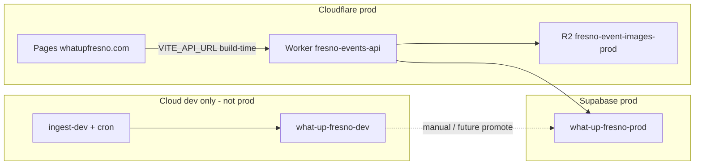

# Production API and full-app deployment plan

**Tracked from:** [LAUNCH_PLAN.md Phase 5](LAUNCH_PLAN.md). Execute when cloud-dev ingest + review are solid.

**Summary:** Prod ships the Hono API Worker (`fresno-events-api`), web on Cloudflare Pages (`whatupfresno.com`), and Supabase `what-up-fresno-prod`. Ingest stays off prod; events are promoted from cloud-dev. The web app is always one SPA; optional home bootstrap JSON speeds the default `/` view.

---

## Phase 5 checklist

- [ ] Deploy cloud-dev API + ingest (`wrangler deploy --env dev`); validate `pnpm dev:web:cloud-dev`
- [ ] Stand up `what-up-fresno-prod`: migrations, `dev-target.env` prod keys, R2 `fresno-event-images-prod`
- [ ] `wrangler secret put … --env prod`; `wrangler deploy --env prod`; attach `api.whatupfresno.com`
- [ ] Promote approved dev `events` (+ R2 images) to prod
- [ ] Build web with `VITE_API_URL=https://api.whatupfresno.com`; deploy Pages (`VITE_COMING_SOON=false`)
- [ ] Optional: `apps/web/public/_headers` for asset vs HTML caching
- [ ] Optional: `scripts/bootstrap-today.ts` — embed default home JSON; React Query hydrate on `/`
- [ ] Optional: recover old deploy runbook from git (`git show <commit>:docs/DEPLOY.md`) if a step is missing here

---

## Architecture at prod



| Layer | Prod component | Not on prod |
|-------|----------------|-------------|
| API | [`apps/api`](../apps/api) Worker `fresno-events-api` | — |
| Web | [`apps/web`](../apps/web) → Pages `apps/web/dist` | — |
| DB | Supabase `what-up-fresno-prod` | — |
| Images | R2 `fresno-event-images-prod` | — |
| Ingest | **Intentionally absent** | [`workers/ingest`](../workers/ingest) — no prod cron |

Public users read **approved** rows in prod `events` only. Scraping and `/admin` review stay on **cloud-dev**; approve on dev, then promote data.

---

## API Worker: wrangler profiles

Config: [`apps/api/wrangler.toml`](../apps/api/wrangler.toml)

| Profile | Command | Worker name | `APP_ENV` | CORS | R2 bucket |
|---------|---------|-------------|-----------|------|-----------|
| Local | `wrangler dev` | `fresno-events-api` | `local` | localhost | dev |
| Cloud dev | `wrangler deploy --env dev` | `fresno-events-api-dev` | `dev` | localhost | dev |
| **Production** | **`wrangler deploy --env prod`** | **`fresno-events-api`** | **`production`** | whatupfresno.com | **prod** |

Intended API URL: **`https://api.whatupfresno.com`** — attach in Cloudflare dashboard (not in wrangler yet).

```bash
cd apps/api
wrangler deploy --env prod
```

`pnpm --filter @fresno-events/api deploy` does **not** pass `--env prod`; use wrangler explicitly.

### Secrets (API prod)

- `SUPABASE_URL`, `SUPABASE_SERVICE_ROLE_KEY` (`dev-target.env` → `SUPABASE_*_CLOUD_PROD`)
- `ADMIN_REVIEW_TOKEN` (if using `/review` on prod)
- Optional: `R2_PUBLIC_BASE_URL`, `SENTRY_DSN` — see [`apps/api/.dev.vars.example`](../apps/api/.dev.vars.example)

```bash
wrangler secret put SUPABASE_URL --env prod
# … repeat per secret
```

---

## Web app → prod API

Build-time API URL (not runtime discovery):

```bash
VITE_API_URL=https://api.whatupfresno.com pnpm --filter @fresno-events/web build
```

Deploy `apps/web/dist` to Pages, domain `whatupfresno.com`. Pre-launch: `VITE_COMING_SOON=true` ([README](../README.md)).

Local smoke against deployed API: `.env.cloud-targets` + `pnpm dev:web:cloud-prod` ([`scripts/dev-web-cloud.sh`](../scripts/dev-web-cloud.sh)).

---

## Database and events before go-live

1. **Schema:** `supabase db push` on prod project ([`scripts/db-migrate.sh`](../scripts/db-migrate.sh) blocks accidental prod unless intentional).
2. **Events:** No ingest on prod. Promote approved dev `events` only ([INGESTION_OVERHAUL_PLAN §12.6](INGESTION_OVERHAUL_PLAN.md)); future `docs/PROMOTION.md`.

---

## Recommended deploy sequence

1. Cloud-dev workers (API + ingest) if not already live.
2. Prod Supabase + R2 + `dev-target.env` prod keys.
3. Prod API secrets + `wrangler deploy --env prod` + `api.whatupfresno.com` DNS.
4. Promote events dev → prod.
5. Pages build + deploy full app.
6. `wrangler tail fresno-events-api`; optional Sentry on web.

**Not in scope:** prod ingest deploy or cron.

---

## Static hosting and SPA (always one app)

`vite build` → static `apps/web/dist` on Pages CDN. Every route uses the same [`index.html`](../apps/web/index.html) + React ([`_redirects`](../apps/web/public/_redirects): `/* /index.html 200`).

| Approach | When |
|----------|------|
| **Default** | Pages + Vite build + separate API Worker |
| **Cache headers** | Optional `public/_headers` — long cache on `/assets/*`, short on `index.html` |
| **Coming soon** | `VITE_COMING_SOON=true` — minimal React, no API |
| **Home bootstrap** | Optional — see below |

There is **no** separate static site that “becomes” the SPA later.

---

## Home bootstrap + React Query (optional speed)

**Goal:** Instant default `/` without a loading spinner. **Not** 365 day pages or 1000+ event HTML files.

### How it works

1. **Build or post-promote:** `scripts/bootstrap-today.ts` fetches `GET /events?limit=12`, embeds JSON in `index.html` (or `bootstrap/today.json`).
2. **App boot:** `queryClient.setQueryData(["events", "home", { mode: "default" }], parsed)`.
3. **`TodayPage`:** Same `queryKey` → `isLoading` false; background refetch when stale (5m today).
4. **Freshness:** Re-bootstrap on promote + redeploy Pages, and/or API refetch — not per-event static rebuilds.

### One SPA for navigation and future filters

| User action | Behavior |
|-------------|----------|
| Lands on `/` | SPA + bootstrap for **default** query only |
| `<Link>` to `/event/$slug` | Client navigation → `useEventDetail` → API |
| `<Link>` to `/calendar` | Client navigation → `useWeekEvents` (7-day window) |
| Filter chip / date on home (future) | Stay on `/`; new `queryKey` → API fetch; no bootstrap for that key |

```ts
// Future shape — plan only
queryKey: ["events", "home", { filter, date: selectedDate ?? "default" }]
```

- **Default:** matches bootstrap → instant list.
- **"Tonight" / picked date:** new key → fetch `listEvents({ from, until, limit })` → optional link to `/calendar` for full week.

Calendar remains one route with a rolling week query — not static `/day/YYYY-MM-DD` × 365. Event detail stays client-only per slug.

### Prerender scope

| Route | Bootstrap? |
|-------|------------|
| `/` default view | Yes (optional) |
| `/` filtered / other date | No — live API |
| `/calendar` | No |
| `/event/$slug` | No |

Optional phase 2: `renderToString` for SEO/LCP markup; JSON bootstrap is enough to remove the spinner.

### Implementation todos (when chosen)

- Add `scripts/bootstrap-today.ts`
- Wire into `pnpm build` when `VITE_API_URL` is set
- Seed cache in `main.tsx` / `query-client.ts`; align `useTodayEvents` query key
- Run bootstrap after event promotion

---

## Gaps / manual steps

| Topic | State |
|-------|--------|
| CI/CD | Manual Wrangler + Pages |
| API custom domain | Dashboard only |
| Event promotion | Manual; `PROMOTION.md` not written |
| `deploy` npm script | No `--env prod` |

---

## Related docs

| Doc | Use |
|-----|-----|
| [LAUNCH_PLAN.md](LAUNCH_PLAN.md) | Master checklist; Phase 5 points here |
| [DATABASE_ACCESS.md](DATABASE_ACCESS.md) | Supabase targets |
| [INGESTION_OVERHAUL_PLAN.md](INGESTION_OVERHAUL_PLAN.md) | Promotion preview §12.6 |
