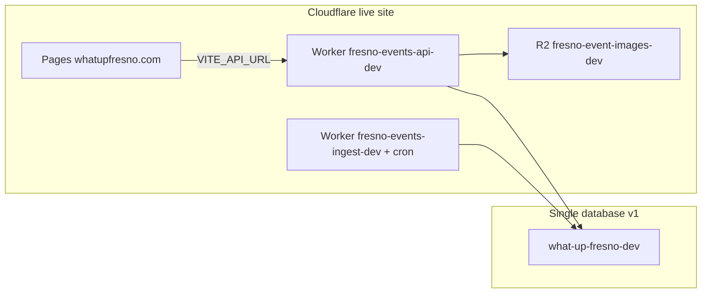

# Production API and full-app deployment plan

**Tracked from:** [LAUNCH_PLAN.md Phase 5](LAUNCH_PLAN.md). Execute when cloud-dev ingest + review are solid.

**Summary:** Live site on Cloudflare (Pages + API + ingest Workers) with **cloud-dev Supabase (`what-up-fresno-dev`) as the single database** for v1. Public domain `whatupfresno.com`; no separate prod DB or promotion until needed later. Optional home bootstrap JSON speeds the default `/` view.

---

## Phase 5 checklist

- [x] Cloud-dev DB ready: migrations on `what-up-fresno-dev`, `dev-target.env` cloud-dev keys; data synced (752 events)
- [x] Deploy API + ingest (`wrangler deploy --env dev`); cloud-dev secrets; `ALLOWED_ORIGINS` for whatupfresno.com; **`api.whatupfresno.com` live**
- [x] Bootstrap events (ingest + approve on cloud-dev)
- [x] **Attach `whatupfresno.com` + `www` to Pages** — live
- [x] Web built with `VITE_API_URL=https://api.whatupfresno.com` + GA/AdSense client; deployed to Pages (`fresno-events.pages.dev`)
- [ ] Cloud-dev ingest cron: Mon/Thu 6am PT — see [INGEST_SCHEDULE.md](INGEST_SCHEDULE.md) (code in repo; deploy + dashboard verify)
- [x] `apps/web/public/_headers` (cache + CSP; `img-src https:` for source hero URLs)
- [x] API custom domain route in `apps/api/wrangler.toml` (`api.whatupfresno.com`)
- [ ] GitHub Actions CI + Workers deploy — see [CI_CD.md](CI_CD.md); connect Pages via Cloudflare GitHub integration
- [ ] GA/AdSense verification on `whatupfresno.com` (slots still manual)

---

## Data strategy (v1 — locked)

**Cloud-dev Supabase (`what-up-fresno-dev`) is the live database** for ingest, admin review, and the public website. No separate prod DB or promotion step for now.

| v1 (now) | Future (if needed) |
|----------|-------------------|
| Single DB: `what-up-fresno-dev` | Optional `what-up-fresno-prod` + promotion job |
| Ingest → approve → publish on same DB | Split read vs write DBs |
| R2 `fresno-event-images-dev` | Optional prod R2 bucket |

Wrangler profile names still say `dev` (`fresno-events-api-dev`) — that is a deploy profile label, not a throwaway environment. Live traffic uses `--env dev` Workers with public domains attached.

## Architecture at launch



| Layer | Live component | Notes |
|-------|----------------|-------|
| Web | [`apps/web`](../apps/web) → Pages `whatupfresno.com` | Build-time `VITE_API_URL` |
| API | [`apps/api`](../apps/api) `fresno-events-api-dev` (`--env dev`) | Secrets → cloud-dev Supabase |
| DB | Supabase **`what-up-fresno-dev`** | Ingest, review, and public reads |
| Images | R2 **`fresno-event-images-dev`** | Dev bucket binding |
| Ingest | [`workers/ingest`](../workers/ingest) `fresno-events-ingest-dev` | Cron on dev profile only |

Public users read **approved** `events` on cloud-dev. `/admin` review uses the same database — approve once, site updates immediately.

---

## API Worker: wrangler profiles

Config: [`apps/api/wrangler.toml`](../apps/api/wrangler.toml)

| Profile | Command | Worker name | `APP_ENV` | CORS | R2 bucket |
|---------|---------|-------------|-----------|------|-----------|
| Local | `wrangler dev` | `fresno-events-api` | `local` | localhost | dev |
| **Live site (v1)** | **`wrangler deploy --env dev`** | **`fresno-events-api-dev`** | **`dev`** | **whatupfresno.com** | **dev** |
| Future split DB | `wrangler deploy --env prod` | `fresno-events-api` | `production` | whatupfresno.com | prod |

Attach **`https://api.whatupfresno.com`** to the **dev** Worker in Cloudflare dashboard.

**Before go-live:** update `[env.dev.vars]` `ALLOWED_ORIGINS` in [`apps/api/wrangler.toml`](../apps/api/wrangler.toml) to include `https://whatupfresno.com` and `https://www.whatupfresno.com`.

```bash
cd apps/api
wrangler deploy --env dev
```

### Secrets (API — cloud-dev for v1)

On **`--env dev`** from [`dev-target.env`](../dev-target.env):

- `SUPABASE_URL` → `SUPABASE_URL_CLOUD_DEV`
- `SUPABASE_SERVICE_ROLE_KEY` → cloud-dev service role
- `ADMIN_REVIEW_TOKEN` → `/review` and `/admin`
- Optional: `R2_PUBLIC_BASE_URL`, `SENTRY_DSN`

```bash
wrangler secret put SUPABASE_URL --env dev
# … repeat per secret
```

**Deferred:** `SUPABASE_*_CLOUD_PROD` / `--env prod` until a separate prod DB is needed.

---

## Web app → prod API

Build-time API URL (not runtime discovery):

```bash
VITE_API_URL=https://api.whatupfresno.com pnpm --filter @fresno-events/web build
```

Deploy `apps/web/dist` to Pages, domain `whatupfresno.com`.

**Attach apex domain (manual):** Dashboard → Workers & Pages → **fresno-events** → Custom domains → add `whatupfresno.com` and `www.whatupfresno.com`. Preview until then: `https://fresno-events.pages.dev`. `api.whatupfresno.com` is already live on the API worker.

### Cloudflare deploy (when you are ready)

In **Pages → Environment variables → Production**, set from [`dev-target.env`](../dev-target.env):

| Variable | Value |
|----------|-------|
| `VITE_API_URL` | `https://api.whatupfresno.com` |
| `VITE_GA_MEASUREMENT_ID` | `G-SP3QWX0EGP` |
| `VITE_ADSENSE_CLIENT_ID` | `ca-pub-1385262226884616` |
| `VITE_ADSENSE_SLOT_*` | After you create 4 ad units in AdSense: `VITE_ADSENSE_SLOT_BANNER_WIDE`, `VITE_ADSENSE_SLOT_BANNER_STACKED`, `VITE_ADSENSE_SLOT_CARD`, `VITE_ADSENSE_SLOT_SIDE` |

**Then deploy.**

Until slot IDs exist, the AdSense script can load but ad areas stay as placeholders.

Vite inlines `VITE_*` at build time — changing env vars requires a new deployment. Optional: `VITE_SENTRY_DSN`. Local dev stays off unless you copy vars into `apps/web/.env.local`.

```bash
VITE_API_URL=https://api.whatupfresno.com \
VITE_GA_MEASUREMENT_ID=G-SP3QWX0EGP \
VITE_ADSENSE_CLIENT_ID=ca-pub-1385262226884616 \
pnpm --filter @fresno-events/web build
```

Post-deploy: GA4 Realtime on `whatupfresno.com`; `https://whatupfresno.com/ads.txt`; AdSense site connection.

Local smoke against deployed API: `.env.cloud-targets` + `pnpm dev:web:cloud-prod` ([`scripts/dev-web-cloud.sh`](../scripts/dev-web-cloud.sh)).

---

## Database and events before go-live

1. **Schema:** `pnpm db:migrate:cloud-dev` on `what-up-fresno-dev`.
2. **Events:** Ingest → approve in `/admin` → published `events` on the **same** cloud-dev DB. No promotion.
3. **Bootstrap:** one-time full ingest from all sources before enabling cron.

**Deferred:** `what-up-fresno-prod`, dev→prod promotion — only if we split databases later.

---

## Recommended launch sequence

1. Cloud-dev DB: migrations + `dev-target.env` cloud-dev keys.
2. Workers (`--env dev`): API + ingest secrets; deploy both; update `ALLOWED_ORIGINS`; attach `api.whatupfresno.com`. Ingest cron — see below.
3. Bootstrap events on cloud-dev.
4. **Cloudflare deploy:** Pages Production env vars; deploy `apps/web/dist`; attach `whatupfresno.com`.
5. CI/CD: `ci.yml` on PR + `deploy-dev.yml` on merge to `main` (live site deploy).
6. `wrangler tail fresno-events-api-dev`; optional Sentry on web.

**Not in scope for v1:** separate prod Supabase, `[env.prod]` Workers, promotion, prod ingest cron.

---

## Cloud-dev ingest cron (venues + sources)

Scraping stays on **cloud-dev only**. Cron triggers live on the **ingest Worker** (`fresno-events-ingest-dev`), not Pages or the API Worker.

| Step | Where |
|------|--------|
| Define schedules | [`workers/ingest/wrangler.toml`](../workers/ingest/wrangler.toml) → `[env.dev.triggers]` |
| Deploy | `cd workers/ingest && wrangler deploy --env dev` |
| Verify | Cloudflare Dashboard → Workers → **fresno-events-ingest-dev** → Triggers → Cron Triggers |

**Schedule:** Monday and Thursday 6am Pacific — **all sources** (`ticketmaster`, `venunite`, `venue-ingest`), full promote + enrichment. No per-day profiles.

Full matrix, bootstrap, and verification: **[INGEST_SCHEDULE.md](INGEST_SCHEDULE.md)**.

**Deploy checklist (summary):**

1. Bootstrap cloud-dev DB with a one-time full promote from all sources.
2. Set ingest dev secrets (`wrangler secret put … --env dev` from `dev-target.env`).
3. Deploy ingest (`wrangler deploy --env dev`); confirm 2 cron triggers in dashboard.
4. After first tick: `ingest_runs` + admin **New** tab show `pending_review` for all sources.
5. Manual override: `pnpm ingest:promote --source=…` anytime.

---

## Static hosting and SPA (always one app)

`vite build` → static `apps/web/dist` on Pages CDN. Every route uses the same [`index.html`](../apps/web/index.html) + React ([`_redirects`](../apps/web/public/_redirects): `/* /index.html 200`).

| Approach | When |
|----------|------|
| **Default** | Pages + Vite build + separate API Worker |
| **Cache + CSP** | [`public/_headers`](../apps/web/public/_headers) — asset cache, CSP for GA/AdSense |
| **Google analytics/ads** | `VITE_GA_*` / `VITE_ADSENSE_*` on Cloudflare Pages (see `dev-target.env`) |
| **Home bootstrap** | Optional — see below |

There is **no** separate static site that “becomes” the SPA later.

---

## Home bootstrap + React Query (optional speed)

**Goal:** Instant default `/` without a loading spinner. **Not** 365 day pages or 1000+ event HTML files.

### How it works

1. **Build or post-promote:** `scripts/bootstrap-today.ts` fetches `GET /events?limit=12`, embeds JSON in `index.html` (or `bootstrap/today.json`).
2. **App boot:** `queryClient.setQueryData(["events", "home", { mode: "default" }], parsed)`.
3. **`TodayPage`:** Same `queryKey` → `isLoading` false; background refetch when stale (5m today).
4. **Freshness:** Re-bootstrap on promote + redeploy Pages, and/or API refetch — not per-event static rebuilds.

### One SPA for navigation and future filters

| User action | Behavior |
|-------------|----------|
| Lands on `/` | SPA + bootstrap for **default** query only |
| `<Link>` to `/event/$slug` | Client navigation → `useEventDetail` → API |
| `<Link>` to `/calendar` | Client navigation → `useWeekEvents` (7-day window) |
| Filter chip / date on home (future) | Stay on `/`; new `queryKey` → API fetch; no bootstrap for that key |

```ts
// Future shape — plan only
queryKey: ["events", "home", { filter, date: selectedDate ?? "default" }]
```

- **Default:** matches bootstrap → instant list.
- **"Tonight" / picked date:** new key → fetch `listEvents({ from, until, limit })` → optional link to `/calendar` for full week.

Calendar remains one route with a rolling week query — not static `/day/YYYY-MM-DD` × 365. Event detail stays client-only per slug.

### Prerender scope

| Route | Bootstrap? |
|-------|------------|
| `/` default view | Yes (optional) |
| `/` filtered / other date | No — live API |
| `/calendar` | No |
| `/event/$slug` | No |

Optional phase 2: `renderToString` for SEO/LCP markup; JSON bootstrap is enough to remove the spinner.

### Implementation todos (when chosen)

- Add `scripts/bootstrap-today.ts`
- Wire into `pnpm build` when `VITE_API_URL` is set
- Seed cache in `main.tsx` / `query-client.ts`; align `useTodayEvents` query key
- Run bootstrap after event promotion

---

## CI/CD

See **[CI_CD.md](CI_CD.md)** for the full setup.

| Layer | How |
|-------|-----|
| **CI** | `.github/workflows/ci.yml` — typecheck, lint, test on PR + `main` |
| **Pages** | Cloudflare Dashboard GitHub connection → auto-build `main` → `whatupfresno.com` |
| **Workers** | `ci.yml` deploy job on push `main` (after tests) — api + ingest `--env dev` |

GitHub secrets for Workers: `CLOUDFLARE_API_TOKEN`, `CLOUDFLARE_ACCOUNT_ID`. Pages `VITE_*` live in Cloudflare Pages env settings.

**Not auto-deployed:** Supabase migrations, worker runtime secrets, separate prod stack.

## Gaps / manual steps

| Topic | State |
|-------|--------|
| CI/CD | [CI_CD.md](CI_CD.md) — `ci.yml` + Cloudflare Pages GitHub connection |
| API custom domain | Dashboard only |
| Separate prod DB / promotion | Deferred — cloud-dev is live DB for v1 |
| `deploy` npm script | No `--env prod` |

---

## Related docs

| Doc | Use |
|-----|-----|
| [LAUNCH_PLAN.md](LAUNCH_PLAN.md) | Master checklist; Phase 5 points here |
| [DATABASE_ACCESS.md](DATABASE_ACCESS.md) | Supabase targets |
| [INGESTION_OVERHAUL_PLAN.md](INGESTION_OVERHAUL_PLAN.md) | Promotion preview §12.6 |
| [INGEST_SCHEDULE.md](INGEST_SCHEDULE.md) | Ingest cron — Mon/Thu all sources |
| [CI_CD.md](CI_CD.md) | GitHub CI + Cloudflare deploy split |
| [INGEST.md](INGEST.md) | Ingest workflow overview |
