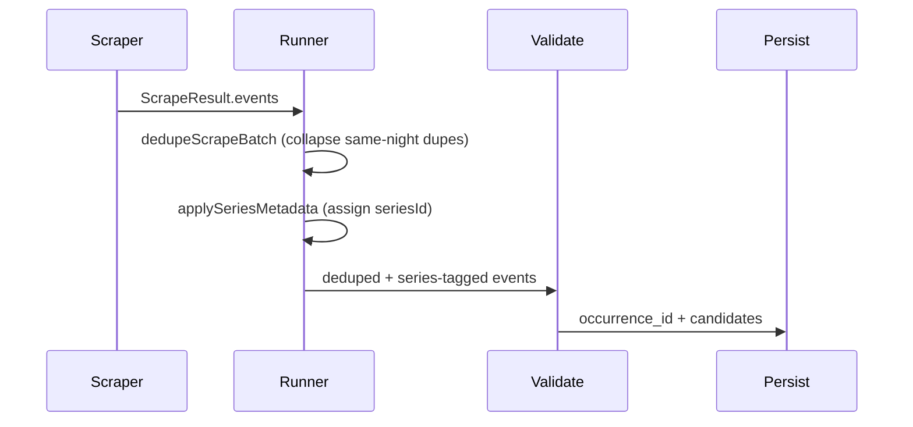

# Series events plan

Standalone plan for recurring shows, multi-day festivals, and duplicate CMS listings. **Does not** replace multi-lane Gate C (bookmarklet) or edit [multi-lane_ingest_8736c8ab.plan.md](../.cursor/plans/multi-lane_ingest_8736c8ab.plan.md).

**Related:** [CROSS_SOURCE_DEDUPE.md](CROSS_SOURCE_DEDUPE.md), [VENUE_INGEST.md](VENUE_INGEST.md).

**Chosen approach:** **Option A** — keep batch dedupe; assign canonical `seriesId` via a **single cross-venue resolver** (not per-scraper one-offs, not merge-time only in batch dedupe).

---

## Problem statement

| Shape | Example | Expected behavior |
|-------|---------|-------------------|
| Recurring series | Backyard trivia every Tuesday | Many dated rows; one logical series in UI |
| Multi-day festival | Big Fresno Fair | Same `series_id`, different days; optional `lineup` |
| Duplicate CMS listings | Backyard 101 vs Backyard101, same night | **One row** in ingest (batch dedupe), one series id (Option A) |

We store **one row per occurrence**. No RRULE expansion in v1 — Visit Fresno API already returns dated rows in the scrape window.

---

## Three layers (do not conflate)

| Layer | Mechanism | Fixes Backyard 6/2 duplicate? |
|-------|-----------|--------------------------------|
| **1. Same-occurrence collapse** | `dedupeScrapeBatch()` in [`runner.ts`](../workers/ingest/src/runner.ts) | **Yes** — drops second row same night |
| **2. Series identity** | `seriesId`, `seriesName`, `lineup` on `NormalizedEvent` → `events` | **No** — groups other Tuesdays |
| **3. Series product** | Admin + `GET /events?series_id=` + detail `seriesEvents` + web | **No** — display only |

**Rules:**

- `occurrence_id` ≠ `series_id` (cross-source vs multi-date).
- **Option A is locked in** — do not implement Option C (merge-time-only `seriesId` rewrite in `scrape-batch-dedupe.utils.ts`).

---

## Decision record (frozen)

| Topic | Decision |
|-------|----------|
| Same-night duplicate listings | **Keep** [`dedupeScrapeBatch`](../workers/ingest/src/lib/scrape-batch-dedupe.utils.ts) — do not remove |
| Canonical series | **Universal resolver** — all venues/sources via `applySeriesMetadata` in runner |
| Series id shape | `series:{venueScope}:{sha256}` — scope = site/host; anchor = title+venue for auto-assign |
| Trigger requirement | **Recurrence signal required** — URL alone does not create a series |
| Auto-assign anchor (v1) | **Title + venue** (`looseTitle` + `normalizeVenue`) — not URL (duplicate CMS slugs like Backyard 101 vs Backyard101 split URL anchor) |
| Native CMS `recid` | Optional `seriesListingRecId` on `NormalizedEvent` (audit only) |
| `relatedEvents` on public detail | **Unchanged** — same-day stub stays `[]` in v1 |
| `seriesEvents` on public detail | **Upcoming series siblings only** (`start_ts >= now()`), max 20, exclude current event |
| `series_id` on candidates table | **No migration** — query `normalized_event->>seriesId` via PostgREST for admin siblings |
| Venue browser scrapers | **In scope** — same resolver; ensure `externalUrl` on listings for URL anchor |

---

## Universal series identity (all venues)

Series is **venue-agnostic logic**: one module in `packages/shared`, one ingest pass in `runner.ts`. Individual scrapers only supply signals (`seriesName`, URLs, config `seriesId`); they do not each invent their own id format.

### When to assign a `seriesId`

| Priority | Signal | Examples |
|----------|--------|----------|
| 1 | **Explicit** `seriesId` on event | `venue.config.json` (Big Fair), festival expand |
| 2 | **Recurrence label** (required for auto-assign) | Visit Fresno `recurrence` → `seriesName`; regex on `seriesName` (`recurring`, `weekly`, `every Tuesday`, …) |
| 3 | **Listing URL** | **Not used as anchor in v1 auto-assign** — duplicate CMS listings can have different slugs for the same show; keep `externalUrl` on events for admin links only |

**Rules:**

- Signal **2 is required** to auto-assign a `seriesId`. A listing URL alone does not make something a series (Tower Theatre one-off concerts have stable URLs too).
- Signal 3 (URL) does **not** change the anchor in v1 — title+venue anchor handles title drift (Backyard 101 vs Backyard101) and duplicate slug listings.
- **Skip** MiLB and obvious one-offs (no recurrence label, no `seriesName`).

### `seriesId` format

```text
scope  = venueScope(source, venueName)             // visitfresnocounty, towertheatre.ticketsauce.com, …
anchor = `title|{looseTitle}|{normalizeVenue(venueName)}`   // v1 auto-assign (handles title drift + duplicate CMS slugs)
payload = `series|${scope}|${anchor}`
seriesId = `series:${scope}:${sha256Hex(payload)}`
```

`listingUrlSeriesAnchor()` remains exported for tests/future use but is **not** used in `computeCanonicalSeriesId` v1.

### `venueScope` mapping

| `source` value | Scope string |
|----------------|--------------|
| `api:visitfresnocounty` | `visitfresnocounty` |
| `api:downtownfresno` | `downtownfresno` |
| `api:milb` | (no series assigned) |
| `scrape:towertheatre.ticketsauce.com` | `towertheatre.ticketsauce.com` |
| `scrape:www.savemartcenter.com` | `savemartcenter.com` |
| Other `scrape:{host}` | hostname with `www.` stripped |
| Fallback | `normalizeVenue(venueName)` slug |

Extract scope from `source` field: strip `api:` or `scrape:` prefix, strip `www.`.

### `listingUrlSeriesAnchor`

```typescript
export function listingUrlSeriesAnchor(url: string | undefined): string | null {
  const normalized = normalizeListingUrl(url);
  if (!normalized) return null;
  // Strip trailing /digits-only segment (e.g. Visit Fresno /event/foo/8487/ → /event/foo/)
  return normalized.replace(/\/\d+\/?$/, "/");
}
```

Reuse `normalizeTitle`, `normalizeVenue`, `normalizeListingUrl`, `sha256Hex` from [`packages/shared/src/occurrence.ts`](../packages/shared/src/occurrence.ts). Implement in [`packages/shared/src/series.ts`](../packages/shared/src/series.ts).

### Central ingest hook

**Create** [`workers/ingest/src/lib/series-metadata.utils.ts`](../workers/ingest/src/lib/series-metadata.utils.ts) with `applySeriesMetadata(events)`.

**Call in** [`runner.ts`](../workers/ingest/src/runner.ts) immediately **after** `dedupeScrapeBatch`, before validation — applies to **every** scraper (`visit-fresno-api`, `venue-ingest`, `milb-api`, etc.).

---

## Pipeline order (ingest)



**Do not** change dedupe to set `seriesId` (Option C). **Do** set `seriesId` in `applySeriesMetadata` after dedupe for all sources.

---

## Current state

| Item | Status |
|------|--------|
| DB `events.series_id`, `series_name`, `lineup` | Done |
| Approve writes series fields | [`review-event.service.ts`](../apps/api/src/routes/review-event.service.ts) |
| Visit Fresno `seriesId = rec:{recid}` | **Remove** — resolver assigns canonical id |
| Universal `applySeriesMetadata` | **Add** in runner (all scrapers) |
| `dedupeScrapeBatch` + preflight summary | Done |
| Admin series UI | Not started |
| `GET /events?series_id=` | Not started |
| Detail `relatedEvents` | Hardcoded `[]` in [`getEventFromSupabase`](../apps/api/src/lib/supabase-events.ts) — keep for same-day; add `seriesEvents` |

---

# Implementation specification (for auto-implementer)

Execute phases in order. Run tests after each phase. Rebuild shared after Phase 1: `cd packages/shared && npx tsc -p tsconfig.json`.

**Critical constraints:**

- Do NOT modify [`scrape-batch-dedupe.utils.ts`](../workers/ingest/src/lib/scrape-batch-dedupe.utils.ts) for series logic.
- Do NOT assign `seriesId` in individual scraper mappers. Only `seriesName`, `seriesListingRecId`, `seriesPresentedBy` in mappers.
- `seriesId` assignment lives exclusively in `applySeriesMetadata()` (called from runner).
- `normalizeListingUrl` and `sha256Hex` are NOT currently re-exported from `packages/shared/src/index.ts`. Import them internally in `series.ts` from `./occurrence.js`.

---

## Phase 0 — Verify batch dedupe (no code unless broken)

**Goal:** Confirm layer 1 works before changing `seriesId`.

**Commands:**

```bash
pnpm ingest:dev   # restart worker
pnpm ingest:preflight --venue=visit-fresno-county
```

**Pass:**

- Summary line includes `−N batch duplicate(s) removed` when N > 0.
- Visit Fresno `events_found` ≈ 239 (not 243).
- Backyard-style pair appears under removed duplicates, not in main event list.

**If still 243:** ensure [`runner.ts`](../workers/ingest/src/runner.ts) calls `dedupeScrapeBatch` before validation (lines ~399–417). Restart worker.

---

## Phase 1a — Universal series resolver (Option A, all venues)

### Step 1. Shared module — `packages/shared/src/series.ts`

**Create** [`packages/shared/src/series.ts`](../packages/shared/src/series.ts):

```typescript
import { normalizeTitle, normalizeVenue, normalizeListingUrl, sha256Hex } from "./occurrence.js";

// --- Detection ---

const RECURRENCE_PATTERN = /\b(recurring|weekly|biweekly|monthly|every\s+(monday|tuesday|wednesday|thursday|friday|saturday|sunday|mon|tue|wed|thu|fri|sat|sun|week|month|day))/i;

export function isRecurringSeries(event: { seriesName?: string }): boolean {
  if (!event.seriesName?.trim()) return false;
  return RECURRENCE_PATTERN.test(event.seriesName);
}

// --- Scope ---

export function venueScope(source: string, venueName: string): string {
  // api:visitfresnocounty → visitfresnocounty
  // scrape:www.savemartcenter.com → savemartcenter.com
  const stripped = source.replace(/^(api|scrape):/, "").replace(/^www\./, "");
  return stripped || normalizeVenue(venueName);
}

// --- Anchor ---

export function listingUrlSeriesAnchor(url: string | undefined): string | null {
  const normalized = normalizeListingUrl(url ?? null);
  if (!normalized) return null;
  return normalized.replace(/\/\d+\/?$/, "/");
}

function titleAnchor(title: string, venueName: string): string {
  const looseTitle = normalizeTitle(title).replace(/\s+/g, "");
  return `title|${looseTitle}|${normalizeVenue(venueName)}`;
}

// --- Main resolver ---

export interface SeriesResolveInput {
  source: string;
  title: string;
  venueName: string;
  seriesId?: string;
  seriesName?: string;
  ticketUrl?: string;
  externalUrl?: string;
}

export interface SeriesResolveResult {
  seriesId: string | undefined;
}

export async function computeCanonicalSeriesId(input: SeriesResolveInput): Promise<SeriesResolveResult> {
  // Priority 1: explicit seriesId already set (venue config, festival expand)
  if (input.seriesId) {
    return { seriesId: input.seriesId };
  }

  // Priority 2: recurrence signal required
  if (!isRecurringSeries(input)) {
    return { seriesId: undefined };
  }

  // Compute scope + title anchor (v1 — URL anchor skipped; see Decision record)
  const scope = venueScope(input.source, input.venueName);
  const anchor = titleAnchor(input.title, input.venueName);

  const payload = `series|${scope}|${anchor}`;
  const hash = await sha256Hex(payload);
  return { seriesId: `series:${scope}:${hash}` };
}
```

**Re-export** from [`packages/shared/src/index.ts`](../packages/shared/src/index.ts):

```typescript
export {
  isRecurringSeries,
  venueScope,
  listingUrlSeriesAnchor,
  computeCanonicalSeriesId,
  type SeriesResolveInput,
  type SeriesResolveResult
} from "./series.js";
```

**Extend** `NormalizedEvent` interface (at line ~292 in `packages/shared/src/index.ts`):

```typescript
  seriesId?: string;
  seriesName?: string;
  seriesListingRecId?: string;   // ADD — source-native listing id (e.g. Visit Fresno recid)
  seriesPresentedBy?: string;    // ADD — optional "Presented By" (Visit Fresno hostname field)
  lineup?: LineupEntry[];
```

### Step 2. Shared tests — `packages/shared/src/series.test.ts`

```typescript
import { describe, expect, it } from "vitest";
import { computeCanonicalSeriesId, isRecurringSeries, venueScope, listingUrlSeriesAnchor } from "./series";

describe("isRecurringSeries", () => {
  it("detects Visit Fresno recurrence strings", () => {
    expect(isRecurringSeries({ seriesName: "Recurring weekly on Tuesday" })).toBe(true);
    expect(isRecurringSeries({ seriesName: "Recurring monthly on the 1st Tuesday" })).toBe(true);
  });
  it("rejects one-off events", () => {
    expect(isRecurringSeries({ seriesName: undefined })).toBe(false);
    expect(isRecurringSeries({ seriesName: "Big Fresno Fair 2026" })).toBe(false);
  });
});

describe("venueScope", () => {
  it("strips api: prefix", () => {
    expect(venueScope("api:visitfresnocounty", "Backyard")).toBe("visitfresnocounty");
  });
  it("strips scrape: prefix and www.", () => {
    expect(venueScope("scrape:www.savemartcenter.com", "Save Mart")).toBe("savemartcenter.com");
  });
});

describe("listingUrlSeriesAnchor", () => {
  it("strips trailing numeric segment", () => {
    expect(listingUrlSeriesAnchor("https://www.visitfresnocounty.org/event/backyard-101-trivia/8487/"))
      .toBe("visitfresnocounty.org/event/backyard-101-trivia/");
  });
  it("returns null for empty/undefined", () => {
    expect(listingUrlSeriesAnchor(undefined)).toBeNull();
  });
});

describe("computeCanonicalSeriesId", () => {
  it("returns existing seriesId unchanged (explicit)", async () => {
    const result = await computeCanonicalSeriesId({
      source: "scrape:fair.com", title: "Fair", venueName: "Fairgrounds",
      seriesId: "series:bigfresnofair:2026", seriesName: "Festival"
    });
    expect(result.seriesId).toBe("series:bigfresnofair:2026");
  });

  it("skips when no recurrence signal", async () => {
    const result = await computeCanonicalSeriesId({
      source: "api:milb", title: "Grizzlies vs Rawhide", venueName: "Chukchansi Park"
    });
    expect(result.seriesId).toBeUndefined();
  });

  it("title drift produces same seriesId", async () => {
    const base = { source: "api:visitfresnocounty", venueName: "The Backyard Social Club", seriesName: "Recurring weekly on Tuesday" };
    const a = await computeCanonicalSeriesId({ ...base, title: "Backyard 101 - Trivia" });
    const b = await computeCanonicalSeriesId({ ...base, title: "Backyard101 - Trivia" });
    expect(a.seriesId).toBe(b.seriesId);
    expect(a.seriesId).toMatch(/^series:visitfresnocounty:[a-f0-9]{64}$/);
  });

  it("different CMS slugs same loose title → same seriesId (URL not used as anchor)", async () => {
    const base = { source: "api:visitfresnocounty", title: "Backyard 101 - Trivia", venueName: "The Backyard Social Club", seriesName: "Recurring weekly on Tuesday" };
    const slugA = await computeCanonicalSeriesId({ ...base, externalUrl: "https://www.visitfresnocounty.org/event/backyard-101-trivia/8487/" });
    const slugB = await computeCanonicalSeriesId({ ...base, title: "Backyard101 - Trivia", externalUrl: "https://www.visitfresnocounty.org/event/backyard101-trivia/6510/" });
    expect(slugA.seriesId).toBe(slugB.seriesId);
  });
});
```

### Step 3. Ingest pass — `workers/ingest/src/lib/series-metadata.utils.ts`

```typescript
import type { NormalizedEvent } from "@fresno-events/shared";
import { computeCanonicalSeriesId } from "@fresno-events/shared";

export async function applySeriesMetadata(events: NormalizedEvent[]): Promise<NormalizedEvent[]> {
  const results: NormalizedEvent[] = [];
  for (const event of events) {
    const { seriesId } = await computeCanonicalSeriesId({
      source: event.source,
      title: event.title,
      venueName: event.venueName,
      seriesId: event.seriesId,
      seriesName: event.seriesName,
      ticketUrl: event.ticketUrl,
      externalUrl: event.externalUrl
    });
    results.push(seriesId ? { ...event, seriesId } : event);
  }
  return results;
}
```

### Step 4. Runner hook — `workers/ingest/src/runner.ts`

**Add import** (near other lib imports at top):

```typescript
import { applySeriesMetadata } from "@/lib/series-metadata.utils";
```

**Insert** after the `dedupeScrapeBatch` block (after line ~417, before `const validation = ...`):

```typescript
  result.events = await applySeriesMetadata(result.events);
```

### Step 5. Visit Fresno mapper changes

**[`visit-fresno-api.types.ts`](../workers/ingest/src/scrapers/visit-fresno-api.types.ts)** — add to `VisitFresnoDocSchema`:

```typescript
  hostname: z.string().optional(),
  recurType: z.union([z.string(), z.number()]).optional(),
```

**[`visit-fresno-api.utils.ts`](../workers/ingest/src/scrapers/visit-fresno-api.utils.ts)** — replace current series logic in `toNormalizedEvent` (lines 217–229):

Before (REMOVE):
```typescript
  const recurrence = raw.recurrence?.trim();
  const seriesId = `api:visitfresnocounty:rec:${raw.recid}`;
  // ...
    seriesId,
    ...(recurrence ? { seriesName: recurrence } : {}),
```

After (REPLACE WITH):
```typescript
  const recurrence = raw.recurrence?.trim();

  return {
    source: "api:visitfresnocounty",
    sourceEventId: raw._id,
    title: raw.title,
    venueName,
    venueCity: raw.city?.trim() || "Fresno",
    startTs: startIso,
    // seriesId is NOT set here — applySeriesMetadata assigns it from seriesName
    ...(recurrence ? { seriesName: recurrence } : {}),
    ...(recurrence ? { seriesListingRecId: raw.recid } : {}),
    ...(raw.hostname?.trim() ? { seriesPresentedBy: raw.hostname.trim() } : {}),
    ...(venueAddress ? { venueAddress } : {}),
    ...(descriptionText ? { descriptionText } : {}),
    ...(externalUrl ? { externalUrl } : {}),
    ...(imageUrl ? { imageUrl } : {})
  };
```

**Tests** — update [`visit-fresno-api.utils.test.ts`](../workers/ingest/src/scrapers/visit-fresno-api.utils.test.ts):

- Assert `toNormalizedEvent` with `recurrence` field produces `seriesName` and `seriesListingRecId` but **no** `seriesId`.
- Integration: run `applySeriesMetadata([toNormalizedEvent(fixtureDoc)!])` → result has `seriesId` matching `/^series:visitfresnocounty:[a-f0-9]{64}$/`.

### Step 6. Venue listing URLs

**Review** [`workers/ingest/src/venues/_shared/listing-detail.utils.ts`](../workers/ingest/src/venues/_shared/listing-detail.utils.ts) line 90:

```typescript
...(config.seriesId ? { seriesId: config.seriesId } : {})
```

This already passes through explicit `venue.config.json` `seriesId`. No change needed if the venue config has a series. For other venues, ensure the listing-to-detail flow preserves `externalUrl` on the `NormalizedEvent` so the URL anchor can fire when `seriesName` is also present.

Check: does `mergeListingWithDetail` (line 40) preserve `externalUrl`? **Yes** — line 72 keeps `listing.externalUrl`. No change needed.

### Step 7. Build + test

```bash
cd packages/shared && npx tsc -p tsconfig.json
cd workers/ingest && npx vitest run src/lib/series-metadata.utils.test.ts src/scrapers/visit-fresno-api.utils.test.ts
```

### 4. Venue config (optional explicit series)

Venues like Big Fair already set `seriesId` in [`venue.config.json`](../workers/ingest/src/venues/big-fresno-fair/venue.config.json). Document pattern: use explicit id for whole-venue festivals; rely on title+venue resolver for recurring trivia nights without config.

---

## Phase 1d — Admin review API + UI

### API

**Create** [`apps/api/src/routes/review-series.utils.ts`](../apps/api/src/routes/review-series.utils.ts):

```typescript
import type { EventCandidate, SeriesSiblingCandidate } from "@fresno-events/shared";

export function toSeriesSiblingCandidate(row: EventCandidate): SeriesSiblingCandidate {
  return {
    id: row.id,
    source: row.source,
    sourceEventId: row.sourceEventId,
    title: row.normalizedEvent.title,
    startTs: row.normalizedEvent.startTs,
    venueName: row.normalizedEvent.venueName,
    status: row.status,
    sourceUrl: row.normalizedEvent.externalUrl
  };
}
```

**Add type** in [`packages/shared/src/index.ts`](../packages/shared/src/index.ts) (near `LinkedEventCandidate`):

```typescript
export interface SeriesSiblingCandidate {
  id: string;
  source: EventSource;
  sourceEventId: string;
  title: string;
  startTs: string;
  venueName: string;
  status: EventCandidateStatus;
  sourceUrl?: string;
}
```

Extend `EventCandidateDetailResponse` interface:

```typescript
seriesSiblings?: SeriesSiblingCandidate[];
```

**Add** `fetchCandidatesBySeriesId` in [`apps/api/src/routes/review-candidate.service.ts`](../apps/api/src/routes/review-candidate.service.ts) — follow existing `fetchCandidatesByOccurrenceId` pattern (`supabaseReviewRequest`, `candidateSelect`, `mapCandidateRow`):

```typescript
export async function fetchCandidatesBySeriesId(
  env: Env,
  seriesId: string,
  excludeId: string,
  options?: { limit?: number }
): Promise<EventCandidate[]> {
  const params = new URLSearchParams({
    select: candidateSelect,
    "normalized_event->>seriesId": `eq.${seriesId}`,
    status: "eq.pending_review",
    canonical_candidate_id: "is.null",
    id: `neq.${excludeId}`,
    order: "start_ts.asc",
    limit: String(options?.limit ?? 30)
  });
  const rows = await supabaseReviewRequest<SupabaseCandidateRow[]>(
    env,
    `/rest/v1/event_candidates?${params}`
  );
  return rows.map(mapCandidateRow);
}
```

**Wire** in [`review.ts`](../apps/api/src/routes/review.ts) inside `GET /candidates/:id` handler — after `linkedCandidates` is computed:

```typescript
import { fetchCandidatesBySeriesId } from "./review-candidate.service";
import { toSeriesSiblingCandidate } from "./review-series.utils";

// Inside handler after linkedCandidates:
const seriesId = candidate.normalizedEvent?.seriesId;
const seriesSiblings: SeriesSiblingCandidate[] =
  seriesId
    ? (await fetchCandidatesBySeriesId(c.env, seriesId, candidate.id)).map(toSeriesSiblingCandidate)
    : [];

// Add to response object:
// ...(seriesSiblings.length ? { seriesSiblings } : {})
```

Mirror the pattern used for `linkedCandidates` / [`LinkedSourcesSection`](../apps/web/src/features/admin-review/LinkedSourcesSection.tsx).

**Tests:** [`apps/api/src/routes/review-series.utils.test.ts`](../apps/api/src/routes/review-series.utils.test.ts) — unit test `toSeriesSiblingCandidate` with mock data.

### Web

**Create** [`apps/web/src/features/admin-review/SeriesSection.tsx`](../apps/web/src/features/admin-review/SeriesSection.tsx):

```tsx
import { CalendarDays } from "lucide-react";
import type { SeriesSiblingCandidate } from "@fresno-events/shared";
import { formatPacificDateTimeLabel } from "@/lib/pacific-time";

interface SeriesSectionProps {
  seriesId: string;
  seriesName?: string;
  seriesListingRecId?: string;
  seriesPresentedBy?: string;
  seriesSiblings: SeriesSiblingCandidate[];
}

export function SeriesSection({ seriesId, seriesName, seriesListingRecId, seriesPresentedBy, seriesSiblings }: SeriesSectionProps) {
  return (
    <section className="rounded-xl border border-neutral-800 bg-neutral-950/60 p-4">
      <h3 className="text-xs font-semibold uppercase tracking-[0.2em] text-neutral-400">Series</h3>
      <div className="mt-2 space-y-1 text-sm text-neutral-300">
        {seriesName && <p>{seriesName}</p>}
        {seriesPresentedBy && <p className="text-xs text-neutral-500">Presented by: {seriesPresentedBy}</p>}
        <p className="font-mono text-xs text-neutral-600 break-all">{seriesId}</p>
        {seriesListingRecId && <p className="text-xs text-neutral-600">recid: {seriesListingRecId}</p>}
      </div>
      {seriesSiblings.length > 0 && (
        <ul className="mt-3 space-y-2">
          {seriesSiblings.map((sib) => (
            <li key={sib.id} className="flex flex-wrap items-center justify-between gap-2 rounded-lg border border-neutral-800 px-3 py-2 text-sm">
              <div className="min-w-0">
                <p className="font-medium text-neutral-100">{sib.title}</p>
                <p className="flex items-center gap-1 text-xs text-neutral-500">
                  <CalendarDays className="h-3 w-3" />
                  {formatPacificDateTimeLabel(sib.startTs)} · {sib.venueName}
                </p>
              </div>
            </li>
          ))}
        </ul>
      )}
    </section>
  );
}
```

**Update** [`AdminReviewWorkspace.types.ts`](../apps/web/src/features/admin-review/AdminReviewWorkspace.types.ts) — add to `CandidateDetailProps`:

```typescript
  seriesSiblings?: SeriesSiblingCandidate[];
```

**Update** [`CandidateDetail.tsx`](../apps/web/src/features/admin-review/CandidateDetail.tsx):

- Import `SeriesSection` and `type SeriesSiblingCandidate`.
- Destructure `seriesSiblings` from props.
- Render `<SeriesSection />` above `<LinkedSourcesSection />` when `candidate.normalizedEvent.seriesId` exists:

```tsx
{candidate.normalizedEvent.seriesId && (
  <SeriesSection
    seriesId={candidate.normalizedEvent.seriesId}
    seriesName={candidate.normalizedEvent.seriesName}
    seriesListingRecId={candidate.normalizedEvent.seriesListingRecId}
    seriesPresentedBy={candidate.normalizedEvent.seriesPresentedBy}
    seriesSiblings={seriesSiblings ?? []}
  />
)}
```

**Update** [`ReviewWorkspace.tsx`](../apps/web/src/features/admin-review/ReviewWorkspace.tsx) (not `AdminReviewWorkspace.tsx` — that is the token shell) — pass `seriesSiblings={candidateQuery.data.seriesSiblings ?? []}` into `<CandidateDetail>` at both render sites (~lines 509–516).

---

## Phase 2a — `GET /events?series_id=`

**File:** [`apps/api/src/routes/events.ts`](../apps/api/src/routes/events.ts)

- Read `series_id` query param (snake_case to match DB).
- If present and non-empty, pass to `listEventsFromSupabase`.
- If `series_id` set without valid `from`, still require `from` (existing behavior) OR default `from` to now — **use existing `from` default**; add filter only.

**File:** [`apps/api/src/lib/supabase-events.ts`](../apps/api/src/lib/supabase-events.ts)

- Extend `listEventsFromSupabase` options: `seriesId?: string`.
- In `createEventParams`: `series_id=eq.${seriesId}` when set.

**File:** [`apps/api/src/routes/events.utils.ts`](../apps/api/src/routes/events.utils.ts)

- Add `parseSeriesId(value: string | undefined): string | undefined` — trim, max length 200, reject empty.

**Tests:** unit test for `parseSeriesId`; optional integration test with mocked Supabase params.

---

## Phase 2b — Detail `seriesEvents` (do not overload `relatedEvents`)

**Naming:** `EventDetailView` already uses `detail.relatedEvents` for **“OTHER EVENTS THIS DAY”** (currently always empty). Series siblings need a **separate field** so we do not break same-day semantics.

**Extend** `EventDetailResponse` in [`packages/shared/src/index.ts`](../packages/shared/src/index.ts):

```typescript
export interface EventDetailResponse {
  event: Event;
  venue: Venue;
  heroImage?: ImageAsset;
  galleryImages: ImageAsset[];
  relatedEvents: EventListItem[];   // same-day (unchanged; still [] in v1)
  seriesEvents?: EventListItem[];     // ADD — upcoming siblings in same series
}
```

**File:** [`apps/api/src/lib/supabase-events.ts`](../apps/api/src/lib/supabase-events.ts) — `getEventFromSupabase` (line ~66):

**Keep** `relatedEvents: []`. **Add** `seriesEvents` when `row.series_id` is set:

```typescript
  let seriesEvents: EventListItem[] | undefined;
  if (row.series_id) {
    const siblingParams = createEventParams({
      series_id: `eq.${row.series_id}`,
      status: `in.(${scheduledStatuses.join(",")})`,
      id: `neq.${row.id}`,
      start_ts: `gte.${new Date().toISOString()}`,
      order: "start_ts.asc",
      limit: "20"
    });
    const siblingRows = await fetchEventRows(url, key, siblingParams);
    const mapped = siblingRows.map(mapEventRow);
    if (mapped.length > 0) {
      seriesEvents = mapped;
    }
  }

  return {
    ...item,
    galleryImages,
    relatedEvents: [],
    ...(seriesEvents ? { seriesEvents } : {})
  };
```

**Note:** `createEventParams` (line ~141) accepts arbitrary filter keys and passes them as URL params to PostgREST. `series_id` is a column on the `events` table, so `series_id=eq.{value}` works directly.

**Tests:** Unit test with mocked `fetchEventRows` — verify:
- When `row.series_id` is null → no `seriesEvents` on response; `relatedEvents` stays `[]`.
- When `row.series_id` is set → sibling query filters correct; max 20; self excluded; `relatedEvents` still `[]`.

---

## Phase 3 — Public web

**File:** [`apps/web/src/features/event-detail-sections/EventDetailView.tsx`](../apps/web/src/features/event-detail-sections/EventDetailView.tsx)

### 3a. Series subtitle (in hero/title area, ~line 97)

If `event.seriesName` is present, render a small-caps subtitle below the title:

```tsx
{event.seriesName && (
  <p className={styles.seriesSubtitle}>{event.seriesName}</p>
)}
```

Add `seriesSubtitle` to the module.scss: `font-size: 0.75rem; text-transform: uppercase; letter-spacing: 0.15em; color: var(--neutral-400);`.

### 3b. Lineup section (SecHead 02, lines 108–117)

Currently shows a hardcoded single act (`event.title`). Replace with:

```tsx
<section className={styles.sec}>
  {event.lineup && event.lineup.length > 0 ? (
    <>
      <SecHead number="02" script="who's playing" title="LINEUP" />
      <div className={styles.lineup}>
        {event.lineup.map((entry, i) => (
          <div key={i} className={styles.act}>
            <p className={styles.who}>{entry.name}</p>
            {entry.time && <p className={styles.when}>{entry.time}</p>}
            {entry.stage && <p className={styles.where}>{entry.stage}</p>}
          </div>
        ))}
      </div>
    </>
  ) : null}
</section>
```

**Omit the entire section** when `lineup` is empty or absent — no more placeholder showing just the event title.

### 3c. "More in this series" section (new, before "Other Events This Day" / SecHead 06)

Use **`detail.seriesEvents`** (Phase 2b), not `detail.relatedEvents`:

```tsx
const seriesRows = (detail.seriesEvents ?? []).map((item) => toEventRowViewModel(item));

{seriesRows.length > 0 && (
  <section className={styles.sec}>
    <SecHead number="06" script="same series" title="MORE IN THIS SERIES" count={seriesRows.length} />
    <div className={styles.relatedList}>
      {seriesRows.map((row) => (
        <EventRow key={row.id} event={row} slug={row.slug} />
      ))}
    </div>
  </section>
)}
```

Keep **“OTHER EVENTS THIS DAY”** on `detail.relatedEvents` (still empty in v1). Renumber that section to SecHead `"07"` only if both sections are visible; otherwise leave numbering as-is until same-day fetch is implemented.

### 3d. Types

Verify `EventDetailResponse.seriesEvents` is wired through [`apps/web/src/services/events.types.ts`](../apps/web/src/services/events.types.ts) if it re-exports API types. `event.seriesName` and `event.lineup` are already mapped in `mapEventRow`.

**No new routes** in v1.

---

## Phase 4 — Docs

**Create** [`docs/SERIES_EVENTS.md`](SERIES_EVENTS.md) — operator summary: three layers, Option A, verify commands.

**Update** [`VENUE_INGEST.md`](VENUE_INGEST.md) — link to `SERIES_EVENTS.md` and `SERIES_EVENTS_PLAN.md`.

**Update** [`INGEST_TESTING.md`](INGEST_TESTING.md) — add checklist rows for batch dedupe + canonical `seriesId` prefix.

---

## Testing matrix

| ID | Scenario | Pass criteria |
|----|----------|---------------|
| T0 | Visit Fresno preflight | `−N batch duplicate(s)`; ~239 events |
| T1 | Recurring row JSON | `seriesId` matches `/^series:[^:]+:[a-f0-9]{64}$/`; scope matches source/venue |
| T2 | Title drift hash | Backyard 101 vs Backyard101 same venue → same `seriesId` (unit test) |
| T3 | Admin detail | `seriesSiblings` lists other pending Tuesdays same series |
| T4 | Approve trivia | `events.series_id` = canonical id |
| T5 | Public detail API | `seriesEvents.length >= 1` for future sibling; `relatedEvents` still `[]` |
| T6 | Web | Lineup hidden when empty; series subtitle + sibling rows visible |
| T7 | Cross-source | Unchanged — `linkedCandidates` still by `occurrence_id` |

---

## Implementation todos

| ID | Phase | Task | Status |
|----|-------|------|--------|
| s0-verify | 0 | Preflight batch dedupe ~239 | pending |
| s1-shared-series | 1a | `packages/shared/src/series.ts` universal resolver + tests | pending |
| s1-ingest-pass | 1a | `series-metadata.utils.ts` + runner hook (all scrapers) | pending |
| s1-visit-mapper | 1a | Visit Fresno: seriesName/recid only; drop native seriesId | pending |
| s1-visit-meta | 1a | `hostname` / `recurType` on types + `seriesPresentedBy` | pending |
| s1-venue-urls | 1a | Ensure venue listing events carry externalUrl for URL anchor | pending |
| s1-admin-api | 1d | `fetchCandidatesBySeriesId` + detail response | pending |
| s1-admin-ui | 1d | `SeriesSection.tsx` + wire CandidateDetail | pending |
| s2-list | 2a | `GET /events?series_id=` | pending |
| s2-detail | 2b | `seriesEvents` in `getEventFromSupabase` (keep `relatedEvents: []`) | pending |
| s3-web | 3 | EventDetailView series + lineup + siblings | pending |
| s4-docs | 4 | `SERIES_EVENTS.md` + cross-links | pending |

---

## Migration note (existing candidates)

Candidates already persisted with `seriesId = api:visitfresnocounty:rec:{recid}` will keep that value until re-scraped. On next ingest run, the resolver assigns the new canonical id. Until then:

- Admin siblings query may not group old + new candidates for the same show.
- This is acceptable — re-scrape within one window refreshes all rows. No backfill migration needed.

---

## Out of scope

- Bookmarklet / manual capture (multi-lane Gate C)
- `series` Postgres table / `/series/:slug` pages
- RRULE expansion
- Option C merge-time series in batch dedupe
- Removing `dedupeScrapeBatch`
- URL-only series assignment (without recurrence signal)
- URL anchor for auto-assign `seriesId` (v2 — duplicate CMS slugs break it; v1 uses title+venue)
- Editing multi-lane ingest plan file

---

## File touch list (quick reference)

| Action | Path |
|--------|------|
| Create | `packages/shared/src/series.ts`, `series.test.ts` |
| Create | `workers/ingest/src/lib/series-metadata.utils.ts`, `series-metadata.utils.test.ts` |
| Edit | `packages/shared/src/index.ts` (NormalizedEvent, SeriesSiblingCandidate, EventDetailResponse.seriesEvents) |
| Edit | `workers/ingest/src/runner.ts` |
| Edit | `workers/ingest/src/scrapers/visit-fresno-api.{types,utils}.ts`, `visit-fresno-api.utils.test.ts` |
| Review | `workers/ingest/src/venues/_shared/listing-detail.utils.ts` — externalUrl on listings |
| Create | `apps/api/src/routes/review-series.utils.ts` |
| Edit | `apps/api/src/routes/review-candidate.service.ts`, `review.ts` |
| Create | `apps/web/src/features/admin-review/SeriesSection.tsx` |
| Edit | `apps/web/src/features/admin-review/CandidateDetail.tsx`, `ReviewWorkspace.tsx`, `AdminReviewWorkspace.types.ts` |
| Edit | `apps/api/src/routes/events.ts`, `events.utils.ts`, `lib/supabase-events.ts` |
| Edit | `apps/web/src/features/event-detail-sections/EventDetailView.tsx` |
| Create | `docs/SERIES_EVENTS.md` |
| Edit | `docs/VENUE_INGEST.md`, `docs/INGEST_TESTING.md` |
| **Do not edit** | `scrape-batch-dedupe.utils.ts` (except tests if needed) |

---

## Recommended order

1. Phase 0 — verify batch dedupe  
2. Phase 1a — shared resolver + runner pass + Visit Fresno mapper + venue URL check  
3. Phase 1d — admin review series UI  
4. Phase 2 — API (`?series_id=` + detail `seriesEvents`)  
5. Phase 3 — public web (lineup, series subtitle, siblings)  
6. Phase 4 — operator docs
